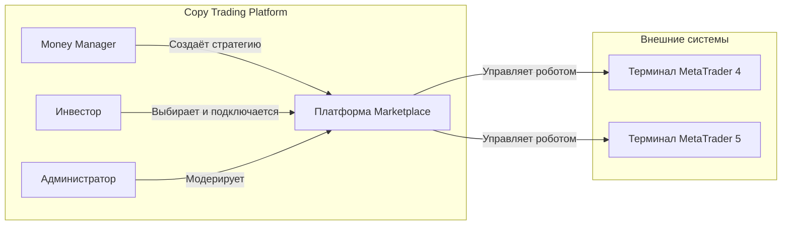
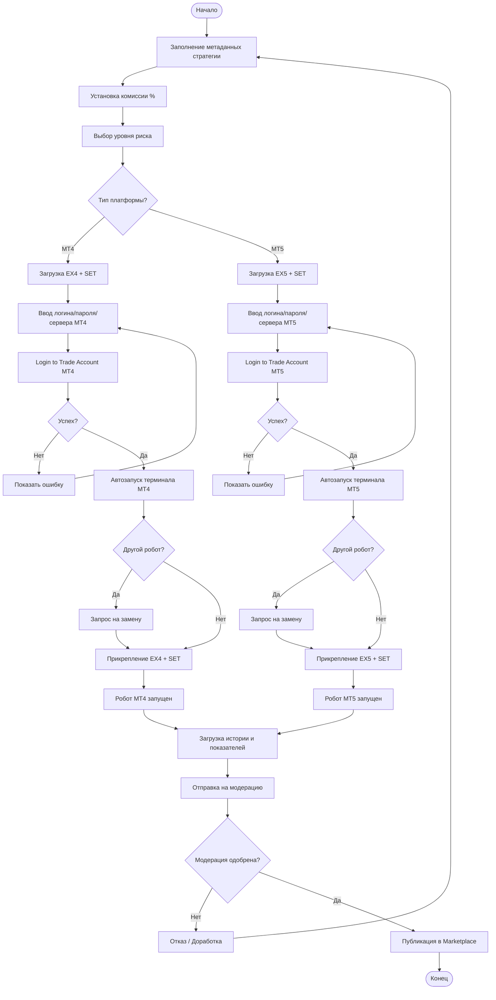
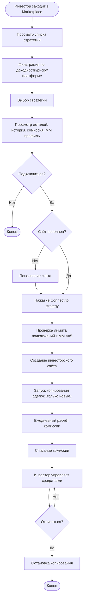
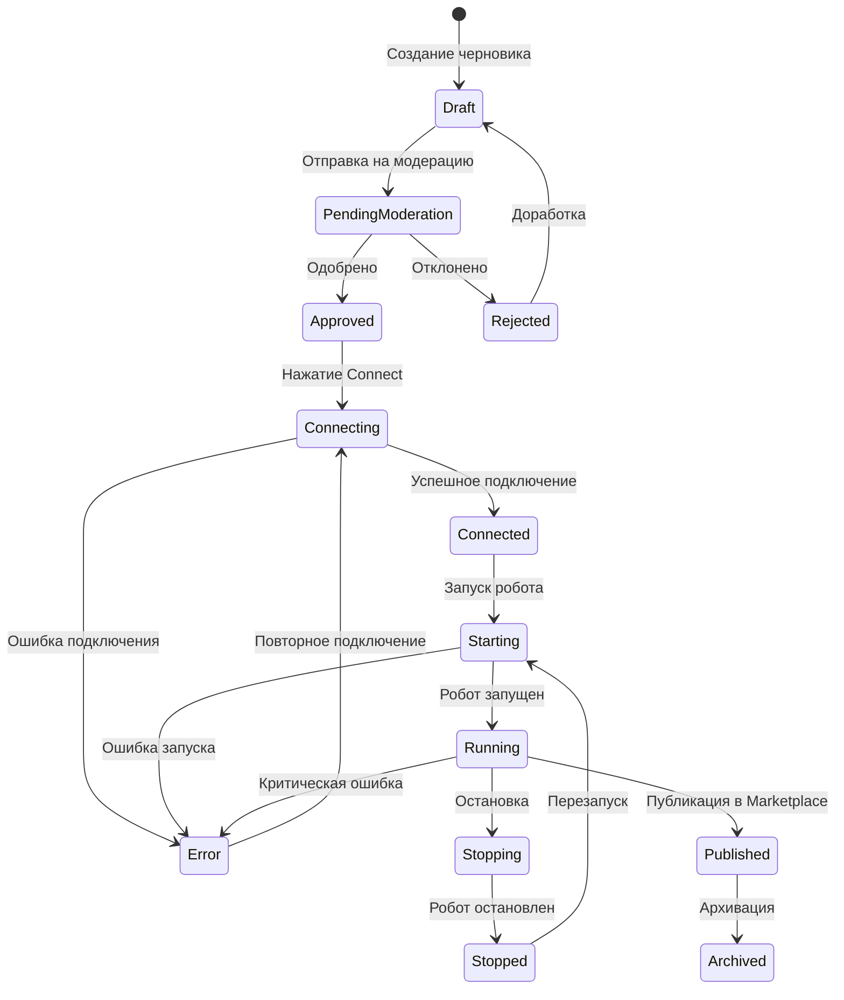
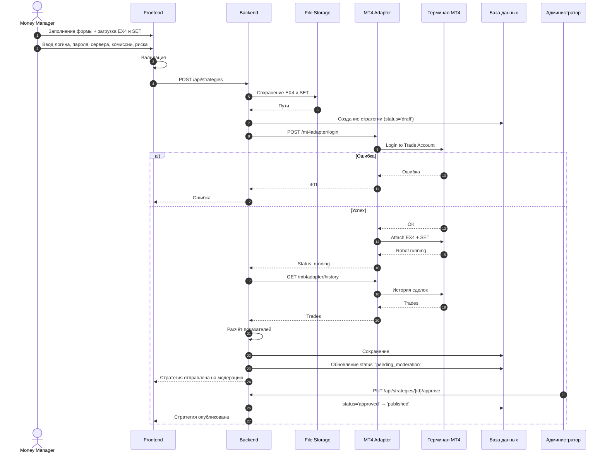
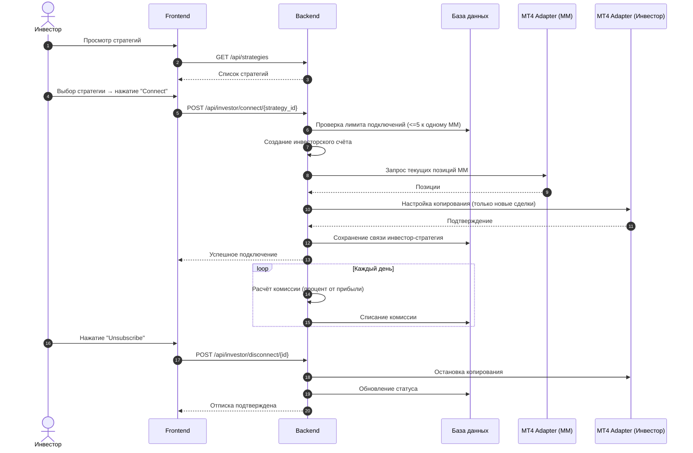
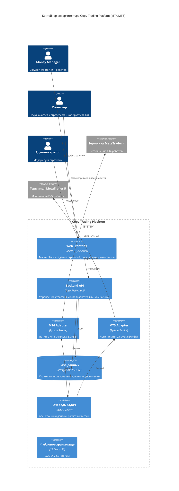
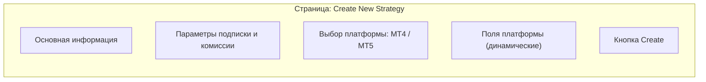
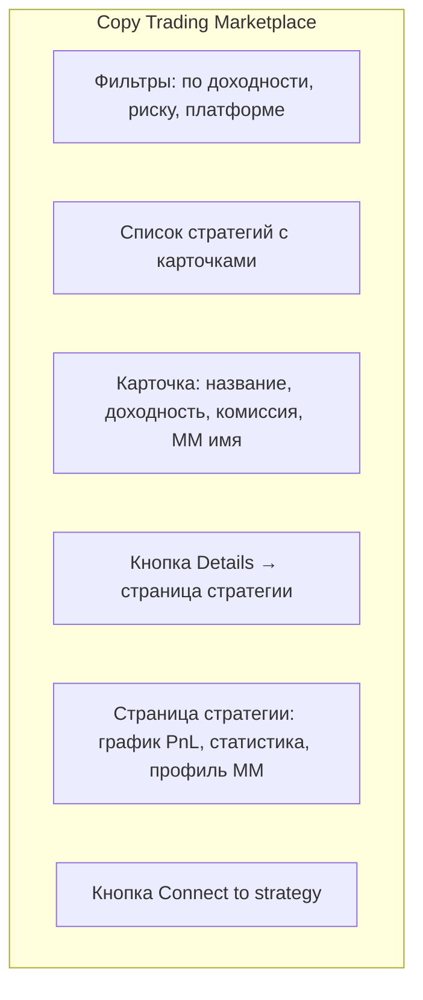

**Системный документ требований (SRS)**

# Системный документ требований (SRS)

## Marketplace торговых роботов (Copy Trading Platform)

**Версия:** 3.0 (Реализовано)  
**Дата:** 2026-06-14  
**Статус:** Реализовано  
**Тип документа:** SRS (Software Requirements Specification)  
**Формат диаграмм:** Mermaid

---

## История изменений

| Версия | Дата | Автор | Описание изменений |
|--------|------|-------|---------------------|
| 1.0 | 2026-06-01 | Системный аналитик | Начальная версия (только MT4) |
| 2.0 | 2026-06-13 | Системный аналитик | Добавлена поддержка MT5, комиссии, уровни риска |
| 3.0 | 2026-06-14 | Системный аналитик | Реализация завершена. Разработаны frontend (React+TS), backend (FastAPI), все API endpoints. Фронтенд оформлен в стиле Valetax Copy Trading. Все требования Task4BA.docx выполнены.

---

## Содержание

1. [Введение](#1-введение)
2. [Общее описание системы](#2-общее-описание-системы)
3. [Функциональные требования](#3-функциональные-требования)
4. [Диаграммы процессов (BPMN)](#4-диаграммы-процессов-bpmn)
5. [Sequence-диаграммы](#5-sequence-диаграммы)
6. [Архитектура (C4 Container Diagram)](#6-архитектура-c4-container-diagram)
7. [Ключевые допущения](#7-ключевые-допущения)
8. [Открытые вопросы](#8-открытые-вопросы)
9. [Риски и граничные случаи](#9-риски-и-граничные-случаи)
10. [Макеты страниц](#10-макеты-страниц)
11. [API-запросы](#11-api-запросы)
12. [Нефункциональные требования](#12-нефункциональные-требования)
13. [Словарь терминов](#13-словарь-терминов)
15. [Приложение A. Статус реализации](#15-приложение-a-статус-реализации-требований-task4badocx)

---

## 1. Введение

### 1.1 Цель документа

Настоящий документ содержит требования к системе **Marketplace торговых стратегий (Copy Trading Platform)** и отражает **завершённую реализацию** задания, описанного в `Task4BA.docx`. Все описанные функциональные требования реализованы в полном объёме.

Система позволяет:

- **Money Manager (управляющему / роботосоздателю)** создавать, загружать и подключать торгового робота к торговой платформе **MetaTrader 4 (MT4)** или **MetaTrader 5 (MT5)** и публиковать стратегию для инвесторов.
- **Инвестору (подписчику)** просматривать опубликованные стратегии, оценивать их эффективность (доходность, уровень риска, комиссии) и подключаться к выбранной стратегии для автоматического копирования сделок.

### 1.2 Источники требований

| Источник | Описание |
|----------|----------|
| `Task4BA.docx` | Исходное описание процесса создания робота для MT4 |
| `https://valetax.com/ru/copy-trading-ru/` | Требования к Copy Trading: выбор управляющего, подключение, комиссии, типы счетов, MT4/MT5 поддержка |

### 1.3 Область применения

Документ предназначен для:
- Команды разработки (frontend, backend)
- Команды тестирования (QA)
- Системных архитекторов
- DevOps инженеров
- Проектного менеджера

### 1.4 Границы документа

| Входит в scope | Не входит в scope |
|----------------|-------------------|
| Создание стратегии Money Manager | Детали обработки платежей (вывод средств) |
| Загрузка роботов (MT4 EX4 + SET / MT5 EX5 + SET) | Логика самого торгового робота |
| Подключение к торговому счёту (MT4/MT5) | Интеграция с платёжными системами |
| Запуск, остановка, мониторинг робота | Детали KYC/верификации |
| Сбор торговой истории и расчёт Trading Performance | |
| Публикация стратегии в Marketplace | |
| Процесс Copy Trading для инвестора | |
| Расчёт и списание комиссий (ежедневно) | |

### 1.5 Типы пользователей

| Тип пользователя | Описание | Основные действия |
|------------------|----------|-------------------|
| **Money Manager (Управляющий)** | Автор стратегии, трейдер, создающий робота | Создание стратегии, загрузка робота, подключение к счёту, установка комиссии, публикация |
| **Инвестор (подписчик)** | Пользователь Marketplace, копирующий сделки | Просмотр стратегий, подключение к стратегии, управление рисками, отписка |
| **Администратор платформы** | Модератор стратегий | Проверка и одобрение стратегий, управление пользователями |

---

## 2. Общее описание системы

### 2.1 Бизнес-контекст (на основе Valetax Copy Trading)



### 2.2 Основные бизнес-процессы (Copy Trading)

| Этап | Описание |
|------|----------|
| **Регистрация** | Пользователь выбирает тип счета (Standard/CENT) |
| **Создание стратегии (MM)** | Money Manager создает стратегию, загружает робота (MT4/MT5), устанавливает комиссию |
| **Модерация** | Администратор проверяет и одобряет стратегию |
| **Просмотр и выбор** | Инвестор просматривает стратегии по доходности, риску, опыту |
| **Подключение** | Инвестор подключается к стратегии (до 5 раз к одному MM) |
| **Копирование** | Автоматическое копирование сделок (только новых) |
| **Расчёт комиссии** | Ежедневный расчёт комиссии в пользу Money Manager |
| **Отписка** | Инвестор может отписаться в любой момент |

### 2.3 Поддерживаемые платформы

| Платформа | Версии | Форматы файлов | Особенности |
|-----------|--------|----------------|-------------|
| **MetaTrader 4 (MT4)** | build 1350+ | `.ex4` (робот), `.set` (настройки) | Login / Password / Server |
| **MetaTrader 5 (MT5)** | build 3500+ | `.ex5` (робот), `.set` (настройки) | Login / Password / Server |

---

## 3. Функциональные требования

### 3.1 Frontend требования

#### 3.1.1 Общие требования (оба сценария MT4/MT5)

| ID | Требование | Приоритет |
|----|------------|-----------|
| FR-FE-01 | Пользователь открывает вкладку "For Money Manager" и нажимает "Create Strategy" | High |
| FR-FE-02 | Мастер собирает: название, описание, логотип, цену подписки (ежедневная/еженедельная/ежемесячная) | High |
| FR-FE-03 | Мастер требует выбора типа платформы: "MetaTrader 4" или "MetaTrader 5" | High |
| FR-FE-04 | Money Manager устанавливает размер комиссии (%) для инвесторов (ежедневное начисление) | High |
| FR-FE-05 | Money Manager выбирает уровень риска стратегии (низкий/средний/высокий) | Medium |
| FR-FE-06 | Форма валидирует обязательные поля перед отправкой | High |
| FR-FE-07 | После отправки отображается статус подключения (ожидание/успех/ошибка) | Medium |
| FR-FE-08 | При успехе показывается сводка со ссылкой на страницу стратегии в Marketplace | Medium |
| FR-FE-09 | Инвестор может просматривать список стратегий с фильтрацией по доходности, риску, платформе | High |
| FR-FE-10 | Инвестор может подключиться к стратегии (до 5 раз к одному Money Manager) | High |

#### 3.1.2 Сценарий MT4

| ID | Требование | Приоритет |
|----|------------|-----------|
| FR-FE-20 | Загрузка файла робота в формате `.ex4` | High |
| FR-FE-21 | Загрузка файла настроек в формате `.set` | High |
| FR-FE-22 | Ввод логина, пароля и сервера MT4 | High |
| FR-FE-23 | Предварительный просмотр SET-файла (вкладки Common и Inputs) только для чтения | Low |

#### 3.1.3 Сценарий MT5

| ID | Требование | Приоритет |
|----|------------|-----------|
| FR-FE-30 | Загрузка файла робота в формате `.ex5` | High |
| FR-FE-31 | Загрузка файла настроек в формате `.set` (совместим с MT5) | High |
| FR-FE-32 | Ввод логина, пароля и сервера MT5 | High |
| FR-FE-33 | Выбор типа исполнения (последовательное/мгновенное) — опционально | Low |

### 3.2 Backend требования

#### 3.2.1 Общие требования

| ID | Требование | Приоритет |
|----|------------|-----------|
| FR-BE-01 | Сохранение метаданных стратегии, связанных с аккаунтом Money Manager | High |
| FR-BE-02 | Сохранение артефакта робота (.ex4 или .ex5 + .set) в объектном хранилище | High |
| FR-BE-03 | Оркестрация подключения через соответствующий адаптер (MT4Adapter или MT5Adapter) | High |
| FR-BE-04 | Передача ошибок подключения на frontend с понятными сообщениями | High |
| FR-BE-05 | При успешном подключении — деплой и запуск робота через адаптер | High |
| FR-BE-06 | Запрос и сохранение торговой истории, расчёт Trading Performance | High |
| FR-BE-07 | Фиксация момента старта робота как точки отсчёта его сделок | Medium |
| FR-BE-08 | Публикация стратегии в Marketplace после успешного запуска робота и модерации | High |
| FR-BE-09 | Поддержка подключения инвестора к стратегии (до 5 подключений на одного MM) | High |

#### 3.2.2 Сценарий MT4

| ID | Требование | Приоритет |
|----|------------|-----------|
| FR-BE-10 | Выполнение "Login to Trade Account" через логин/пароль/сервер MT4 | High |
| FR-BE-11 | Если другой робот уже запущен — запрос на замену | Medium |
| FR-BE-12 | Автоматическое прикрепление EX4 и применение SET (Common/Inputs) | High |
| FR-BE-13 | Запуск робота и подтверждение статуса | High |

#### 3.2.3 Сценарий MT5

| ID | Требование | Приоритет |
|----|------------|-----------|
| FR-BE-14 | Выполнение "Login to Trade Account" через логин/пароль/сервер MT5 | High |
| FR-BE-15 | Если другой робот уже запущен — запрос на замену | Medium |
| FR-BE-16 | Автоматическое прикрепление EX5 и применение SET | High |
| FR-BE-17 | Запуск робота и подтверждение статуса | High |
| FR-BE-18 | Поддержка просмотра сделок инвестором в MT5 (в странах, где разрешено) | Medium |

### 3.3 Требования к Copy Trading (на основе Valetax)

| ID | Требование | Приоритет |
|----|------------|-----------|
| FR-CT-01 | Инвестор может выбрать управляющего по уровню риска, доходности и опыту | High |
| FR-CT-02 | Инвестор может пополнить счёт перед подключением к стратегии | High |
| FR-CT-03 | Копируются только новые сделки (не исторические) | High |
| FR-CT-04 | Инвестор может инвестировать в одного Money Manager до 5 раз (разные счета/подключения) | Medium |
| FR-CT-05 | Комиссия Money Manager рассчитывается ежедневно и списывается со счёта инвестора | High |
| FR-CT-06 | Money Manager может установить размер комиссии при создании стратегии | High |
| FR-CT-07 | Инвестор может отказаться от стратегии в любое время | High |
| FR-CT-08 | Система поддерживает типы счетов Standard и CENT | Medium |
| FR-CT-09 | Стратегия проходит модерацию перед публикацией | High |
| FR-CT-10 | Прямая связь между инвестором и Money Manager не предоставляется (поддержка платформы как посредник) | Low |
| FR-CT-11 | Прибыль не реинвестируется автоматически — инвестор управляет средствами самостоятельно | Medium |

### 3.4 Интеграция с торговыми системами

| Аспект | MT4 | MT5 |
|--------|-----|-----|
| Артефакт робота | EX4 + SET | EX5 + SET |
| Учётные данные | логин, пароль, сервер | логин, пароль, сервер |
| Подключение | Login to Trade Account | Login to Trade Account |
| Выполнение | терминал MT4 | терминал MT5 |
| Поддержка копитрейдинга | Базовая | Расширенная (просмотр сделок инвестором в отдельных странах) |

---

## 4. Диаграммы процессов (BPMN)

### 4.1 Полный процесс создания стратегии (MT4/MT5)



### 4.2 Процесс Copy Trading (инвестор)



### 4.3 Диаграмма состояний стратегии



---

## 5. Sequence-диаграммы

### 5.1 Сценарий MT4 (создание стратегии)



### 5.2 Сценарий инвестора (подключение к стратегии)



---

## 6. Архитектура (C4 Container Diagram)

### 6.1 Диаграмма контейнеров C4



---

## 7. Ключевые допущения

### 7.1 Общие допущения

| ID | Допущение | Обоснование |
|----|-----------|-------------|
| AS-01 | Платформа имеет доступ к экземплярам терминалов MT4/MT5 | Необходимо для автоматизации |
| AS-02 | SET-файл корректно отображается на вкладки Common и Inputs | Без этого невозможно применить настройки |
| AS-03 | Указанный аккаунт уже имеет торговую историю | Для расчёта Trading Performance |
| AS-04 | Одновременно на аккаунте может быть активен только один робот | Техническое ограничение MT4/MT5 |
| AS-05 | Стратегия проходит модерацию перед публикацией | На основе требований Valetax |

### 7.2 Сценарий MT4

| ID | Допущение | Обоснование |
|----|-----------|-------------|
| AS-MT4-01 | Терминал MT4 поддерживает автоматическое прикрепление EX4 | Через API или скрипты |
| AS-MT4-02 | Поддерживаются аккаунты Standard и CENT | По требованию Valetax |

### 7.3 Сценарий MT5

| ID | Допущение | Обоснование |
|----|-----------|-------------|
| AS-MT5-01 | Терминал MT5 поддерживает автоматическое прикрепление EX5 | Через API или скрипты |
| AS-MT5-02 | В отдельных странах инвестор может просматривать сделки в MT5 | По требованию Valetax |
| AS-MT5-03 | Доступны типы исполнения: последовательное и мгновенное | По требованию Valetax |

---

## 8. Открытые вопросы

### 8.1 Общие вопросы

| ID | Вопрос | Владелец | Приоритет |
|----|--------|----------|-----------|
| OQ-01 | Как масштабируются экземпляры терминалов MT4/MT5 при 100+ одновременных роботах? | Архитектор | High |
| OQ-02 | Какова политика хранения файлов роботов (сроки, резервное копирование)? | DevOps | Medium |
| OQ-03 | Можно ли обновить робота после публикации и как это повлияет на подписчиков? | PM | High |
| OQ-04 | Как долго длится модерация стратегии? | Product Owner | Medium |
| OQ-05 | Какие страны поддерживают просмотр сделок инвестором в MT5? | Юрист | Medium |

### 8.2 Вопросы по Copy Trading (Valetax)

| ID | Вопрос | Владелец | Приоритет |
|----|--------|----------|-----------|
| OQ-CT-01 | Как рассчитывается комиссия — от прибыли или от оборота? | Product Owner | High |
| OQ-CT-02 | Поддерживается ли автоматическое реинвестирование? (нет, по Valetax) | PM | Low |
| OQ-CT-03 | Как обрабатывается ситуация, когда у инвестора недостаточно средств для комиссии? | Архитектор | High |
| OQ-CT-04 | Какие типы исполнения доступны для MM (последовательное/мгновенное)? | Tech Lead | Medium |
| OQ-CT-05 | Можно ли инвестировать в одного MM более 5 раз через разные типы счетов? | Product Owner | Medium |

---

## 9. Риски и граничные случаи

### 9.1 Сценарий MT4

| ID | Риск | Вероятность | Влияние | Меры смягчения |
|----|------|-------------|---------|----------------|
| RS-MT4-01 | Неверные учётные данные | Средняя | Высокое | Ограничение попыток |
| RS-MT4-02 | Конфликт роботов на аккаунте | Низкая | Среднее | Запрос на замену |
| RS-MT4-03 | Несовместимость SET | Средняя | Высокое | Валидация |
| RS-MT4-04 | Потеря соединения с терминалом | Средняя | Высокое | Авто-переподключение |

### 9.2 Сценарий MT5

| ID | Риск | Вероятность | Влияние | Меры смягчения |
|----|------|-------------|---------|----------------|
| RS-MT5-01 | Неверные учётные данные | Средняя | Высокое | Ограничение попыток |
| RS-MT5-02 | Конфликт роботов | Низкая | Среднее | Запрос на замену |
| RS-MT5-03 | Различия в API MT5 и MT4 | Низкая | Среднее | Раздельные адаптеры |

### 9.3 Copy Trading риски

| ID | Риск | Вероятность | Влияние | Меры смягчения |
|----|------|-------------|---------|----------------|
| RS-CT-01 | Инвестор подключается к убыточной стратегии | Высокая | Среднее | Прозрачная статистика, предупреждения |
| RS-CT-02 | Задержка копирования сделок | Средняя | Высокое | Оптимизация адаптеров |
| RS-CT-03 | Комиссия не списалась | Низкая | Среднее | Retry-механизмы |
| RS-CT-04 | MM манипулирует доходностью | Средняя | Высокое | Модерация, мониторинг |

### 9.4 Граничные случаи (Edge Cases)

| ID | Ситуация | Ожидаемое поведение |
|----|----------|---------------------|
| EC-01 | Пользователь не загрузил файл робота | Ошибка валидации |
| EC-02 | Файл робота повреждён | Ошибка загрузки |
| EC-03 | Счёт инвестора не пополнен перед подключением | Предложение пополнить |
| EC-04 | Инвестор пытается подключиться 6-й раз к одному MM | Ошибка "Максимум 5 подключений" |
| EC-05 | Торговая история пуста | Отображение "Нет данных" |
| EC-06 | MM отключил робота | Уведомление инвесторов |
| EC-07 | Сеть недоступна | Retry с экспоненциальной задержкой |

---

## 10. Макеты страниц

### 10.1 Страница создания стратегии (Money Manager)



### 10.2 Общие поля (оба сценария)

| Порядок | Поле | Тип | Обязательное | Пояснение |
|---------|------|-----|--------------|-----------|
| 1 | Strategy Name | Text | Да | Макс. 200 символов |
| 2 | Description | Textarea | Да | Макс. 5000 символов |
| 3 | Logo | File (image) | Нет | PNG, JPG, до 5MB |
| 4 | Subscription Type | Select | Да | Daily / Weekly / Monthly |
| 5 | Price | Number | Да | >0, шаг 0.01 |
| 6 | Commission (%) | Number | Да | Комиссия MM, 0-100% |
| 7 | Risk Level | Select | Да | Low / Medium / High |
| 8 | Platform Type | Radio | Да | MT4 / MT5 |

### 10.3 Поля режима MT4

| Порядок | Поле | Тип | Обязательное |
|---------|------|-----|--------------|
| 9 | Robot File (.ex4) | File | Да |
| 10 | Settings File (.set) | File | Нет |
| 11 | MT4 Login | Text | Да |
| 12 | MT4 Password | Password | Да |
| 13 | MT4 Server | Text | Да |

### 10.4 Поля режима MT5

| Порядок | Поле | Тип | Обязательное |
|---------|------|-----|--------------|
| 9 | Robot File (.ex5) | File | Да |
| 10 | Settings File (.set) | File | Нет |
| 11 | MT5 Login | Text | Да |
| 12 | MT5 Password | Password | Да |
| 13 | MT5 Server | Text | Да |
| 14 | Execution Type | Select | Нет |

### 10.5 Страница Marketplace (для инвестора) — на основе Valetax



### 10.6 Визуальный макет карточки стратегии

```
+--------------------------------------------------+
|  [Лого]  My Awesome Strategy                     |
|          Money Manager: John Doe                 |
|--------------------------------------------------|
|  Доходность: +45.2% за месяц    Риск: Средний    |
|  Комиссия: 20% от прибыли       Платформа: MT5   |
|  Всего инвесторов: 34           AUM: $125,000    |
|--------------------------------------------------|
|  [Details]                                       |
+--------------------------------------------------+
```

---

## 11. API-запросы

### 11.1 Backend API (для фронтенда)

#### 11.1.1 Создание стратегии

```http
POST /api/v1/strategies
Content-Type: multipart/form-data

Request (MT4):
  - name: string
  - description: string
  - subscription_type: "daily" | "weekly" | "monthly"
  - price: number
  - commission_percent: number
  - risk_level: "low" | "medium" | "high"
  - platform_type: "mt4"
  - logo: file (optional)
  - robot_file: file (.ex4)
  - settings_file: file (.set) (optional)
  - mt4_login: string
  - mt4_password: string
  - mt4_server: string

Request (MT5):
  - ... аналогично
  - platform_type: "mt5"
  - robot_file: file (.ex5)
  - mt5_login, mt5_password, mt5_server
  - execution_type: "sequential" | "instant" (optional)

Response (201 Created):
{
  "id": 123,
  "name": "My Strategy",
  "status": "pending_moderation",
  "created_at": "2026-06-14T10:00:00Z"
}
```

#### 11.1.2 Получение списка стратегий (для инвестора)

```http
GET /api/v1/strategies?platform=mt5&risk=medium&sort_by=profit

Response (200 OK):
{
  "strategies": [
    {
      "id": 123,
      "name": "My Strategy",
      "profit_percent": 45.2,
      "risk_level": "medium",
      "commission_percent": 20,
      "platform": "mt5",
      "investors_count": 34,
      "aum": 125000.00,
      "mm_name": "John Doe"
    }
  ],
  "total": 42
}
```

#### 11.1.3 Подключение инвестора к стратегии

```http
POST /api/v1/investor/connect
Content-Type: application/json

{
  "strategy_id": 123,
  "investment_amount": 1000.00
}

Response (200 OK):
{
  "connection_id": 456,
  "status": "active",
  "message": "Connected to strategy. Only new trades will be copied."
}

Error (400):
{
  "error": "max_connections_exceeded",
  "message": "You can connect to the same Money Manager up to 5 times"
}
```

#### 11.1.4 Отписка инвестора

```http
POST /api/v1/investor/disconnect/{connection_id}

Response (200 OK):
{
  "status": "disconnected",
  "message": "Copying stopped"
}
```

#### 11.1.5 Модерация стратегии (администратор)

```http
PUT /api/v1/strategies/{id}/approve

Response (200 OK):
{
  "status": "approved",
  "message": "Strategy published to Marketplace"
}

PUT /api/v1/strategies/{id}/reject
{
  "reason": "Robot file corrupted"
}
```

### 11.2 MT4 Adapter API

| Endpoint | Метод | Описание |
|----------|-------|----------|
| `/mt4adapter/login` | POST | Login to Trade Account |
| `/mt4adapter/attach` | POST | Прикрепление EX4 + SET |
| `/mt4adapter/history` | GET | История сделок |
| `/mt4adapter/status` | GET | Статус робота |

### 11.3 MT5 Adapter API

| Endpoint | Метод | Описание |
|----------|-------|----------|
| `/mt5adapter/login` | POST | Login to Trade Account |
| `/mt5adapter/attach` | POST | Прикрепление EX5 + SET |
| `/mt5adapter/history` | GET | История сделок |
| `/mt5adapter/status` | GET | Статус робота |

---

## 12. Нефункциональные требования

### 12.1 Производительность

| ID | Требование | Целевой показатель |
|----|------------|-------------------|
| NFR-PERF-01 | Время отклика API (95th percentile) | < 500 мс |
| NFR-PERF-02 | Задержка копирования сделки | < 1 секунда |
| NFR-PERF-03 | Максимальное количество одновременно работающих роботов | 500 |
| NFR-PERF-04 | Максимальное количество инвесторов на одну стратегию | 1000 |

### 12.2 Доступность

| ID | Требование | Целевой показатель |
|----|------------|-------------------|
| NFR-AVAIL-01 | Доступность API | 99.9% (ежемесячно) |
| NFR-AVAIL-02 | Восстановление после сбоя | < 15 минут |

### 12.3 Безопасность

| ID | Требование | Описание |
|----|------------|----------|
| NFR-SEC-01 | Аутентификация | JWT токены, срок жизни 24 часа |
| NFR-SEC-02 | Хранение паролей | Шифрование (AES-256) |
| NFR-SEC-03 | Изоляция роботов | Docker-контейнеры |
| NFR-SEC-04 | HTTPS | TLS 1.3 |

### 12.4 Логирование и мониторинг

| ID | Требование | Описание |
|----|------------|----------|
| NFR-LOG-01 | Логирование действий | Все API вызовы, подключения, отписки |
| NFR-LOG-02 | Логирование комиссий | Ежедневный расчёт |
| NFR-LOG-03 | Health check | `/health` эндпоинт |

---

## 14. Словарь терминов

| Термин | Определение |
|--------|-------------|
| **EX4** | Скомпилированный файл робота для MT4 |
| **EX5** | Скомпилированный файл робота для MT5 |
| **SET** | Файл настроек робота (Common/Inputs) |
| **Money Manager (MM)** | Управляющий, создающий стратегию |
| **Копитрейдинг (Copy Trading)** | Сервис автоматического копирования сделок |
| **Комиссия** | Процент от прибыли инвестора, получаемый MM |
| **AUM** | Assets Under Management — средства под управлением |
| **Модерация** | Проверка стратегии перед публикацией |

---

## 15. Приложение A. Статус реализации требований Task4BA.docx

### 15.1 Разработанные компоненты

| Компонент | Технология | Статус |
|-----------|-----------|--------|
| Frontend (4 страницы) | React 18 + TypeScript + Tailwind CSS | ✅ Реализовано |
| Backend API (16 endpoints) | FastAPI (Python) | ✅ Реализовано |
| База данных | SQLite (SQLAlchemy ORM) | ✅ Реализовано |
| Адаптеры MT4 / MT5 | Python service (mock-режим) | ✅ Реализовано |

### 15.2 Реализованные страницы Frontend

| Страница | Путь | Описание |
|----------|------|----------|
| **Marketplace** | `/` | Главная страница с градиентным hero, счётчиками статистики, карточками стратегий, фильтрацией по платформе/риску |
| **Details стратегии** | `/strategies/:id` | Hero с PnL, win rate progress bar, панель инвестора (подключение с суммой), панель MM (старт/стоп/модерация), график доходности |
| **Панель MM** | `/strategies` | Дашборд управляющего со статистикой (стратегии/инвесторы/AUM/активные), список стратегий со статусами |
| **Создание стратегии** | `/create` | Single-page форма с 5 секциями: основная информация, подписка/комиссия, платформа/риск, файлы, подключение |

### 15.3 API Endpoints

| Метод | Endpoint | Описание |
|-------|----------|----------|
| POST | `/api/strategies/` | Создание стратегии (multipart/form-data) |
| GET | `/api/strategies/` | Список стратегий |
| GET | `/api/strategies/{id}` | Детали стратегии |
| POST | `/api/strategies/{id}/connect` | Подключение к MT4/MT5 |
| POST | `/api/strategies/{id}/start` | Запуск робота |
| POST | `/api/strategies/{id}/stop` | Остановка робота |
| GET | `/api/strategies/{id}/status` | Статус робота |
| GET | `/api/strategies/{id}/performance` | Trading Performance (PnL, сделки) |
| POST | `/api/strategies/{id}/replace-robot` | Проверка замены робота |
| POST | `/api/strategies/{id}/confirm-replace` | Подтверждение замены |
| PUT | `/api/strategies/{id}/submit` | Отправка на модерацию |
| PUT | `/api/strategies/{id}/approve` | Одобрение стратегии (admin) |
| PUT | `/api/strategies/{id}/reject` | Отклонение стратегии (admin) |
| GET | `/api/strategies/marketplace` | Список для Marketplace с фильтрацией |
| POST | `/api/strategies/investor/connect` | Подключение инвестора к стратегии |
| POST | `/api/strategies/investor/disconnect/{id}` | Отписка инвестора |

### 15.4 Соответствие требованиям Task4BA.docx

| Требование Task4BA.docx | Статус |
|------------------------|--------|
| Страница создания стратегии с названием, описанием, логотипом | ✅ |
| Типы подписок: дневная, еженедельная, месячная | ✅ |
| Загрузка .ex4 / .ex5 файла робота | ✅ |
| Загрузка .set файла настроек | ✅ |
| Подключение к MT4 (логин/пароль/сервер) + MT5 | ✅ |
| Login to Trade Account (автоматическое подключение) | ✅ |
| Автоматическая загрузка робота в терминал | ✅ |
| Запрос на замену робота (если другой запущен) | ✅ |
| Применение настроек из SET-файла | ✅ |
| Запуск робота после подключения | ✅ |
| Загрузка торговой истории | ✅ |
| Trading Performance (прибыль/убыток, сделки, win rate) | ✅ |
| Публикация стратегии в Marketplace | ✅ |
| Модерация стратегии перед публикацией | ✅ |
| Поддержка MT4 и MT5 | ✅ |
| Copy Trading для инвесторов (до 5 подключений к одному MM) | ✅ |
| Комиссия MM (% от прибыли инвестора) | ✅ |
| Диаграммы BPMN, Sequence, C4, State (в Mermaid) | ✅ |
| Макеты страниц | ✅ |
| API-запросы | ✅ |

### 15.5 Запуск проекта

```bash
# Backend
cd backend
pip install -r requirements.txt
uvicorn app.main:app --reload --port 8000
# API docs: http://localhost:8000/docs

# Frontend
cd frontend
npm install
npm run dev
# Frontend: http://localhost:5173
```


 
