**Системный документ требований (SRS)**

# Системный документ требований (SRS)

## Marketplace торговых роботов (Copy Trading Platform)

**Версия:** 4.0  
**Дата:** 2026-06-15  
**Статус:** Реализовано  
**Тип документа:** SRS (Software Requirements Specification)  
**Формат диаграмм:** Mermaid

---

## История изменений

| Версия | Дата | Автор | Описание изменений |
|--------|------|-------|---------------------|
| 1.0 | 2026-06-13 | Системный аналитик | Начальная версия (только MT4) |
| 2.0 | 2026-06-13 | Системный аналитик | Добавлена поддержка MT5, комиссии, уровни риска |
| 3.0 | 2026-06-14 | Системный аналитик | Реализация завершена. Разработаны frontend (React+TS), backend (FastAPI), все API endpoints. |
| 4.0 | 2026-06-15 | Системный аналитик | Новая архитектура: standalone frontend (shadcn/ui, wouter, TanStack Query, recharts), расширенные схемы (withdrawal policy, availability, password protection), трёхуровневая система комиссий (Performance + Subscription + Entry fee + Agent Reward), deploy pipeline (upload/URL/launch), connect-account, paginated trade history, seed endpoint, strategy delete |

---

## Содержание

1. [Введение](#1-введение)
2. [Общее описание системы](#2-общее-описание-системы)
3. [Функциональные требования](#3-функциональные-требования)
4. [Диаграммы процессов (BPMN)](#4-диаграммы-процессов-bpmn)
5. [Sequence-диаграммы](#5-sequence-диаграммы)
6. [Архитектура (C4 Container Diagram)](#6-архитектура-c4-container-diagram)
7. [Ключевые допущения](#7-ключевые-допущения)
8. [Открытые вопросы](#8-открытые-вопросы)
9. [Риски и граничные случаи](#9-риски-и-граничные-случаи)
10. [Макеты страниц](#10-макеты-страниц)
11. [API-запросы](#11-api-запросы)
12. [Нефункциональные требования](#12-нефункциональные-требования)
13. [Словарь терминов](#13-словарь-терминов)
14. [Приложение A. Статус реализации](#14-приложение-a-статус-реализации)

---

## 1. Введение

### 1.1 Цель документа

Настоящий документ содержит требования к системе **Marketplace торговых стратегий (Copy Trading Platform)** и отражает **завершённую реализацию v4.0** задания, описанного в исходном видео-задании в файле test task BA.mp4.

Система позволяет:

- **Money Manager (управляющему)** создавать стратегию с детальными параметрами (название, логотип, описание, withdrawal policy, availability, trades history from, password protection), настраивать трёхуровневую систему комиссий (Performance/Subscription/Entry fee + Agent Reward), загружать и подключать торгового робота к MT4/MT5, управлять подключениями инвесторов.
- **Инвестору (подписчику)** просматривать стратегии с фильтрацией, оценивать эффективность (доходность, drawdown, комиссии), изучать пагинированную историю сделок и подключаться к выбранной стратегии.

### 1.2 Источники требований

| Источник | Описание |
|----------|----------|
| `test task BA.mp4` | Исходное описание процесса создания робота для MT4 |
| `https://valetax.com/ru/copy-trading-ru/` | Требования к Copy Trading: выбор управляющего, подключение, комиссии, типы счетов, MT4/MT5 поддержка |

### 1.3 Границы документа

| Входит в scope | Не входит в scope |
|----------------|-------------------|
| Создание стратегии с расширенными параметрами | Детали обработки платежей (вывод средств) |
| Загрузка роботов (MT4 EX4 + SET / MT5 EX5 + SET) через upload или URL | Логика самого торгового робота |
| Deploy pipeline: upload → apply settings → launch terminal | Интеграция с платёжными системами |
| Подключение к торговому счёту (MT4/MT5) | Детали KYC/верификации |
| Система комиссий: Performance + Subscription + Entry fee + Agent Reward | |
| Запуск, остановка, мониторинг робота | |
| Сбор торговой истории, пагинация, AreaChart | |
| Публикация стратегии в Marketplace | |
| Copy Trading для инвестора | |
| Seed-генерация демо-данных | |
| Disconnect и удаление стратегии (MM) | |

### 1.4 Типы пользователей

| Тип пользователя | Описание | Основные действия |
|------------------|----------|-------------------|
| **Money Manager (Управляющий)** | Автор стратегии, трейдер, создающий робота | Создание стратегии, настройка комиссий, загрузка робота, deploy, connect/disconnect инвесторов, удаление стратегии |
| **Инвестор (подписчик)** | Пользователь Marketplace, копирующий сделки | Просмотр стратегий, изучение истории/графиков, подключение к стратегии, отписка |
| **Администратор платформы** | Модератор стратегий | Проверка и одобрение стратегий, управление пользователями |

---

## 2. Общее описание системы

### 2.1 Бизнес-контекст

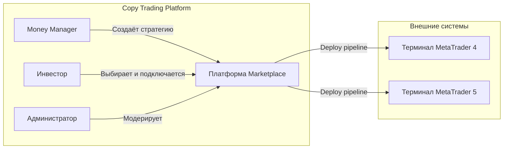

### 2.2 Основные бизнес-процессы

| Этап | Описание |
|------|----------|
| **Создание стратегии** | MM заполняет форму: название, логотип, описание, withdrawal policy, availability, trades history from, password protection |
| **Настройка комиссий** | MM устанавливает Performance Fee % + Agent Reward %, Subscription Fee (Daily/Weekly/Monthly/Annual) + Agent Reward %, Entry Fee % + Agent Reward % |
| **Deploy робота** | MM загружает .ex4/.ex5 + .set файлы (upload или URL), задаёт параметры подключения (логин/пароль/сервер, MT версия, график, таймфрейм). Apply settings → Launch terminal |
| **Подключение** | Автоматический логин в MT терминал, прикрепление робота, применение настроек, запуск |
| **Просмотр (инвестор)** | Список стратегий, детальная страница с AreaChart, пагинированной историей сделок, показателями (drawdown, win rate) |
| **Подключение инвестора** | Инвестор открывает DeployDialog, вводит данные своего MT счёта, копирует сделки |
| **Управление (MM)** | Disconnect инвестора, удаление стратегии |

### 2.3 Поддерживаемые платформы

| Платформа | Версии | Форматы файлов | Особенности |
|-----------|--------|----------------|-------------|
| **MetaTrader 4 (MT4)** | build 1350+ | `.ex4` (робот), `.set` (настройки) | Login / Password / Server |
| **MetaTrader 5 (MT5)** | build 3500+ | `.ex5` (робот), `.set` (настройки) | Login / Password / Server |

---

## 3. Функциональные требования

### 3.1 Frontend требования

#### 3.1.1 Страница Home (`/`)

| ID | Требование | Приоритет |
|----|------------|-----------|
| FR-FE-01 | Отображение статистики платформы: Total Strategies, Total Investors, Total Funds, Top Growth | High |
| FR-FE-02 | Кнопка "Generate demo strategies" для заполнения БД тестовыми данными | Medium |
| FR-FE-03 | Табы: How does it work, Available Strategies, Investment Results, For Money Manager | High |
| FR-FE-04 | StrategiesTab — список карточек стратегий с названием, логотипом, доходностью, drawdown, инвесторами, AUM, комиссией | High |
| FR-FE-05 | При клике на стратегию — переход на StrategyDetail | High |

#### 3.1.2 Страница Strategy Detail (`/strategy/:id`)

| ID | Требование | Приоритет |
|----|------------|-----------|
| FR-FE-10 | Отображение логотипа, названия, breadcrumb | High |
| FR-FE-11 | Profit/Loss AreaChart с градиентной заливкой (зелёный/красный) | High |
| FR-FE-12 | Info Panel: Profit/Loss %, Drawdown %, Min Investment, Investor's funds, Investors, Days, Withdrawal Policy, Trades History From | High |
| FR-FE-13 | Секции комиссий: Performance Fee / Agent Reward, Subscription Fee / Agent Reward, Entry Fee / Agent Reward | High |
| FR-FE-14 | Пагинированная таблица Trade History (20 записей на страницу) | High |
| FR-FE-15 | Paginator с номерами страниц, Previous/Next, подсветка текущей страницы | Medium |
| FR-FE-16 | Кнопка "Connect to strategy" — открывает DeployDialog | High |
| FR-FE-17 | MM controls: Disconnect (отключить инвестора), Delete (удалить стратегию) | Medium |

#### 3.1.3 Strategy Create Tab (For Money Manager)

| ID | Требование | Приоритет |
|----|------------|-----------|
| FR-FE-20 | Поле загрузки логотипа (preview, drag-and-click) | Medium |
| FR-FE-21 | Поля: Strategy Name, Withdrawal Policy (Anytime/Daily/Weekly/Monthly), Min Investment, Trades History From (datetime-local) | High |
| FR-FE-22 | Strategy Availability: All / User Group / User Name + Account (условное появление полей userName/userAccount) | High |
| FR-FE-23 | Textarea для описания | Medium |
| FR-FE-24 | Toggle Password Protected | Low |
| FR-FE-25 | Performance Fee: toggle on/off, Fee %, Agent Fee % | High |
| FR-FE-26 | Subscription Fee: toggle on/off, Type (Daily/Weekly/Monthly/Annual), Fee USD, Agent Fee % | High |
| FR-FE-27 | Entry Fee: toggle on/off, Fee %, Agent Fee % | Medium |
| FR-FE-28 | Форма валидируется через zod (минимум имени, min invest > 0, fee ranges) | High |
| FR-FE-29 | После создания — toast об успехе, сброс формы, возврат к пустому состоянию | Medium |

#### 3.1.4 DeployDialog

| ID | Требование | Приоритет |
|----|------------|-----------|
| FR-FE-30 | Загрузка .ex4/.ex5 файла через upload или URL | High |
| FR-FE-31 | Загрузка .set файла настроек (опционально) | Medium |
| FR-FE-32 | Поля: MT Login, MT Password, MT Server | High |
| FR-FE-33 | Выбор MetaTrader версии (MT4 / MT5) | High |
| FR-FE-34 | Выбор Chart / Timeframe (опционально) | Low |
| FR-FE-35 | Deployment log — пошаговый вывод статуса upload/apply/launch | Medium |
| FR-FE-36 | Кнопка "Deploy" — запускает полный pipeline | High |

### 3.2 Backend требования

#### 3.2.1 Управление стратегиями

| ID | Требование | Приоритет |
|----|------------|-----------|
| FR-BE-01 | POST `/api/strategies/` — создание стратегии со всеми полями (name, minInvest, withdrawalPolicy, passwordProtected, availability, userName, userAccount, tradesHistoryFrom, description, fees) | High |
| FR-BE-02 | GET `/api/strategies/` — список стратегий (StrategyListItem: id, name, logoUrl, growthPercent, minInvest, investors, totalFunds, days, performanceFee, chartPoints) | High |
| FR-BE-03 | GET `/api/strategies/{id}` — детали стратегии (StrategyDetail: все поля + fees + settings) | High |
| FR-BE-04 | DELETE `/api/strategies/{id}` — удаление стратегии (MM) | Medium |
| FR-BE-05 | POST `/api/strategies/seed` — генерация 6 демо-стратегий с реалистичными данными (performance, trades, settings) | Medium |

#### 3.2.2 Performance и Trade History

| ID | Требование | Приоритет |
|----|------------|-----------|
| FR-BE-10 | GET `/api/strategies/{id}/performance` — массив PerformancePoint (date, value) для AreaChart | High |
| FR-BE-11 | GET `/api/strategies/{id}/trades?page=&page_size=` — пагинированная история сделок (TradeHistory: trades[], total, page, pageSize, totalPages) | High |
| FR-BE-12 | `_generate_mock_performance()` — генерация chart точек, сделок, drawdown, win rate на основе days/growth_percent | High |

#### 3.2.3 Deploy и Connect

| ID | Требование | Приоритет |
|----|------------|-----------|
| FR-BE-20 | POST `/{id}/deploy/upload` — загрузка .ex4/.ex5/.set файлов, сохранение в deploy_files/{id}/ | High |
| FR-BE-21 | POST `/{id}/deploy/url` — скачивание файла робота по URL | Medium |
| FR-BE-22 | POST `/{id}/deploy/launch` — генерация .ini файла, запуск MT терминала через subprocess | High |
| FR-BE-23 | POST `/{id}/deploy` — полный pipeline: upload + launch | High |
| FR-BE-24 | POST `/{id}/connect-account` — копирование файлов, генерация .ini, запуск терминала для инвестора | High |
| FR-BE-25 | POST `/{id}/disconnect-investor` — остановка терминала инвестора (MM action) | Medium |

#### 3.2.4 Marketplace и система

| ID | Требование | Приоритет |
|----|------------|-----------|
| FR-BE-30 | GET `/api/healthz` — health check сервера | Low |
| FR-BE-31 | GET `/api/stats` — статистика: totalStrategies, totalInvestors, totalFunds, topGrowth | Medium |
| FR-BE-32 | Остальные legacy endpoints: connect, start, stop, replace-robot, approve, reject, submit, marketplace, investor connect/disconnect | High |

### 3.3 Требования к Fee System

| ID | Требование | Приоритет |
|----|------------|-----------|
| FR-FEE-01 | Три типа комиссии: Performance Fee (%), Subscription Fee (фикс), Entry Fee (%) | High |
| FR-FEE-02 | Каждый тип имеет toggle on/off (performanceFeeEnabled, subscriptionFeeEnabled, entryFeeEnabled) | High |
| FR-FEE-03 | Каждый тип имеет Agent Reward % (performanceAgentFee, subscriptionAgentFee, entryAgentFee) | Medium |
| FR-FEE-04 | Subscription Fee имеет тип периодичности: Daily / Weekly / Monthly / Annual | High |
| FR-FEE-05 | Настройки комиссий хранятся в performance_data["settings"] JSON-блобе | High |

---

## 4. Диаграммы процессов (BPMN)

### 4.1 Полный процесс создания и деплоя стратегии

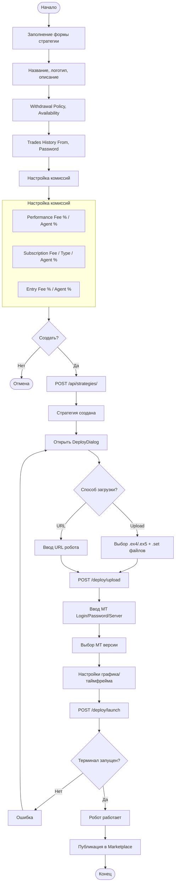

### 4.2 Процесс инвестора (подключение к стратегии)

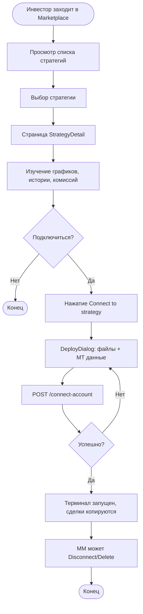

### 4.3 Процесс MM (управление)

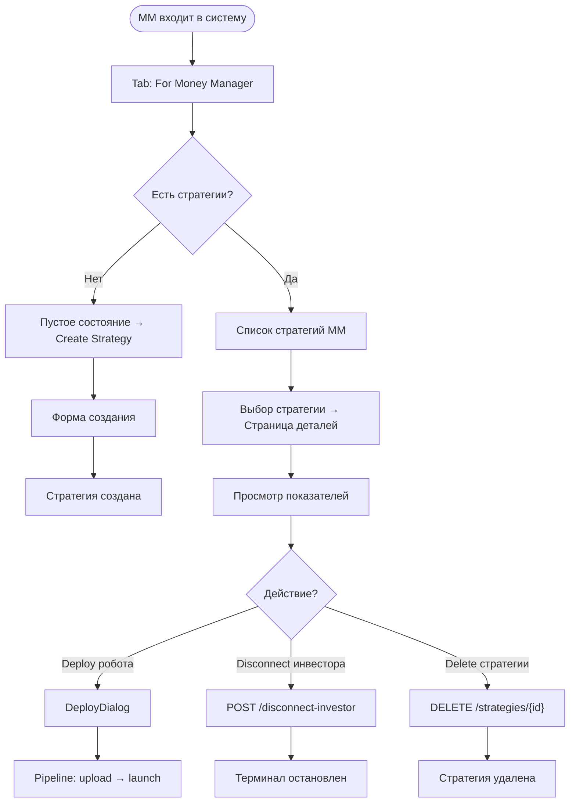

### 4.4 Диаграмма состояний стратегии

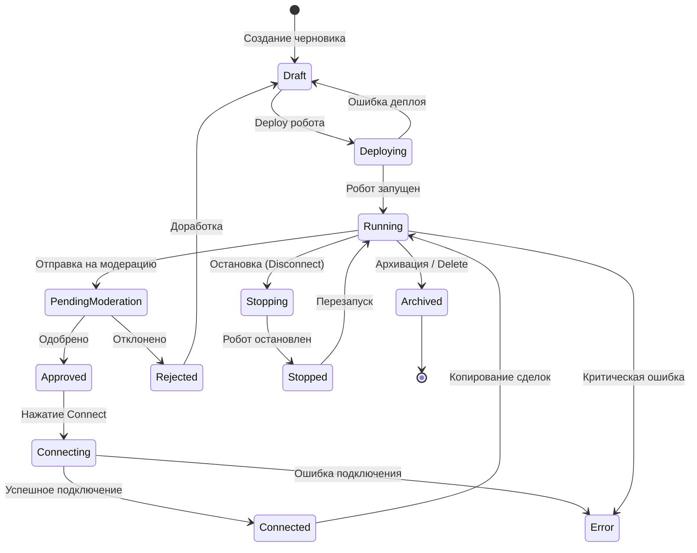

---

## 5. Sequence-диаграммы

### 5.1 Создание стратегии (с расширенными полями)

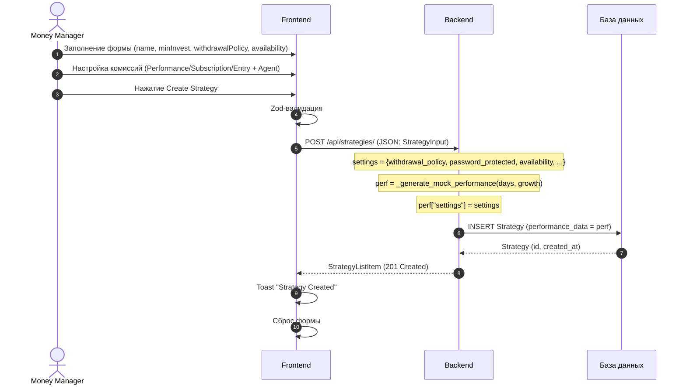

### 5.2 Deploy pipeline (upload + launch)

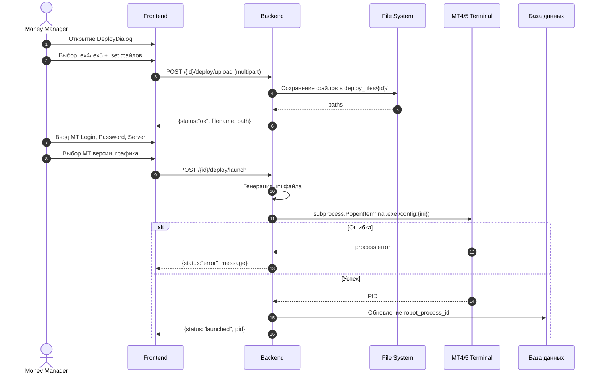

### 5.3 Connect-account (инвестор)

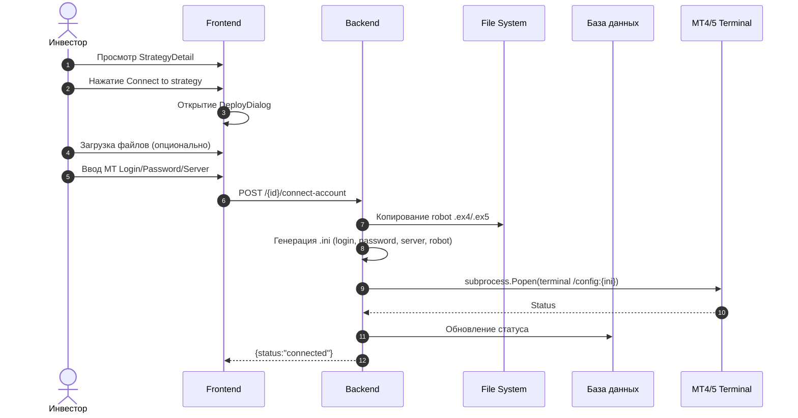

### 5.4 Просмотр Performance и Trade History

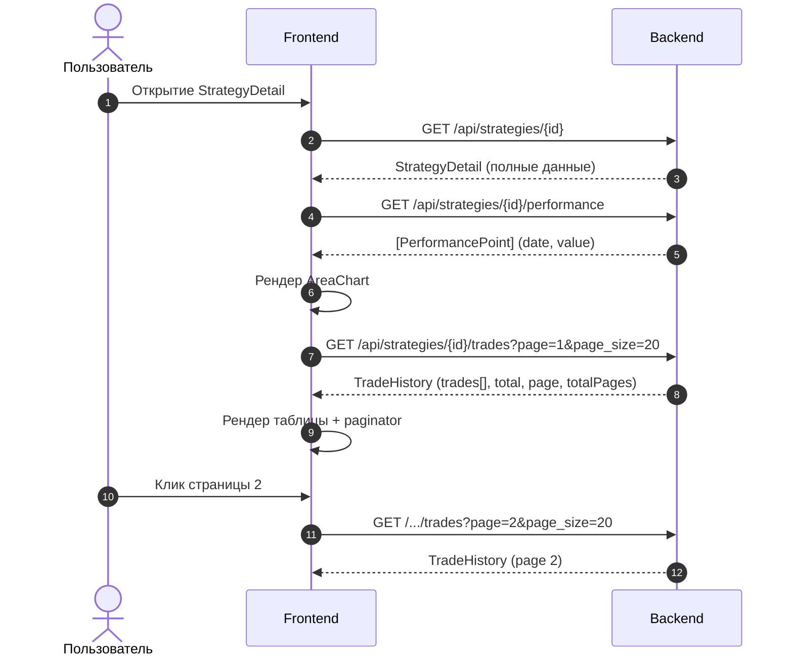

### 5.5 Seed генерация

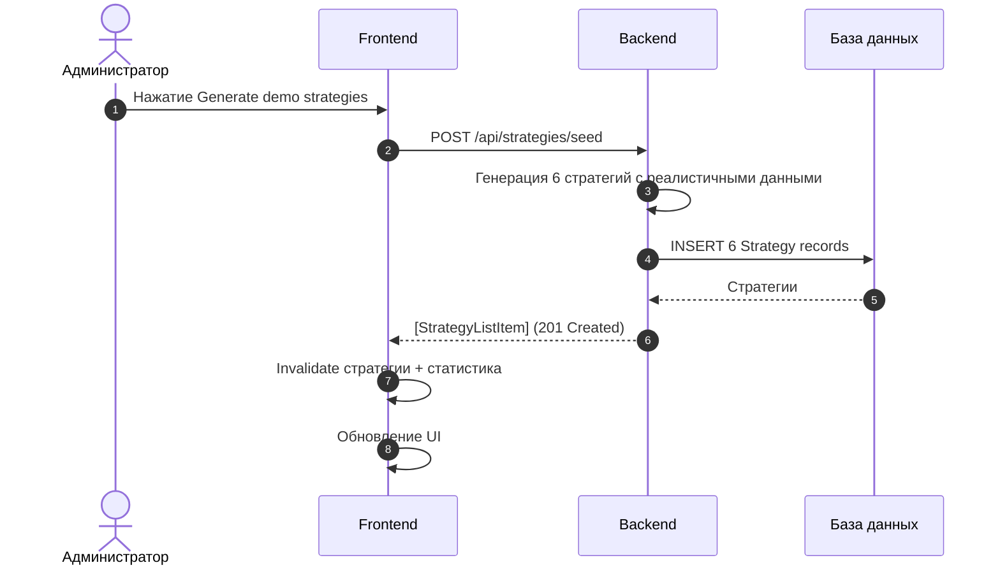

---

## 6. Архитектура (C4 Container Diagram)

### 6.1 Диаграмма контейнеров C4

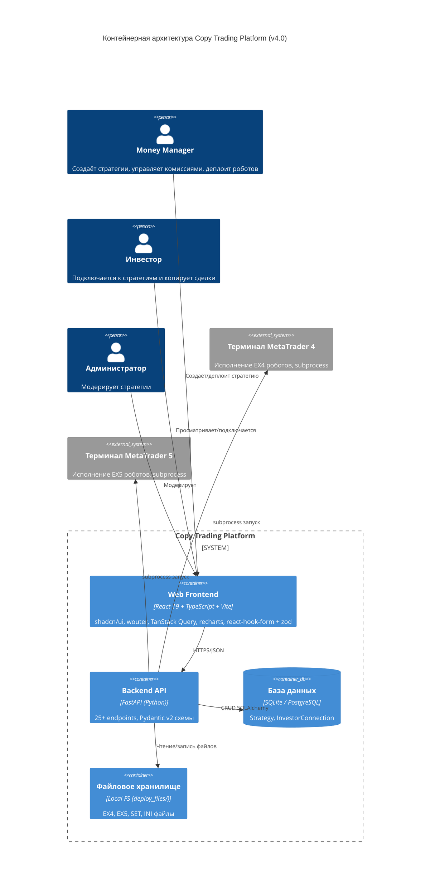

### 6.2 Технологический стек

| Компонент | Технология | Версия |
|-----------|-----------|--------|
| Frontend framework | React | 19.1 |
| Language | TypeScript | 5.9 |
| Build tool | Vite | 7.3 |
| CSS framework | Tailwind CSS | 4.1 |
| UI library | shadcn/ui (Radix primitives) | latest |
| Routing | wouter | 3.3 |
| Server state | TanStack Query | 5.90 |
| Forms | react-hook-form + zod | 7.55 / 3.25 |
| Charts | recharts | 2.15 |
| Backend | Python | 3.14 |
| API framework | FastAPI | latest |
| ORM | SQLAlchemy | latest |
| Validation | Pydantic | v2 |
| Database | SQLite (dev) / PostgreSQL (prod) | - |

---

## 7. Ключевые допущения

### 7.1 Общие допущения

| ID | Допущение | Обоснование |
|----|-----------|-------------|
| AS-01 | Платформа имеет доступ к экземплярам терминалов MT4/MT5 | Необходимо для автоматизации через subprocess |
| AS-02 | SET-файл корректно отображается на вкладки Common и Inputs | Без этого невозможно применить настройки |
| AS-03 | Один робот на один аккаунт (замена только через confirmation) | Техническое ограничение MT4/MT5 |
| AS-04 | Стратегия проходит модерацию перед публикацией | На основе требований Valetax |
| AS-05 | All fee types могут быть включены/выключены независимо | Гибкость для MM |
| AS-06 | Agent Reward — фиксированный % от Performance/Subscription/Entry fee | Модель партнёрской комиссии |
| AS-07 | Seed-стратегии используют `settings` в `performance_data` для fee-полей | Единый формат хранения |

### 7.2 Deploy pipeline

| ID | Допущение | Обоснование |
|----|-----------|-------------|
| AS-DP-01 | Файлы робота валидны (.ex4/.ex5) до загрузки | Валидация на клиенте |
| AS-DP-02 | Терминал MT указан в системном PATH | Для subprocess запуска |
| AS-DP-03 | INI-файл конфигурации корректен для терминала | Формат стандартный для MT |

---

## 8. Открытые вопросы

| ID | Вопрос | Владелец | Приоритет |
|----|--------|----------|-----------|
| OQ-01 | Как масштабируются экземпляры терминалов MT4/MT5 при 100+ роботах? | Архитектор | High |
| OQ-02 | Нужна ли валидация .ex4/.ex5 файлов на сервере? | Tech Lead | Medium |
| OQ-03 | Как обрабатывается ситуация, когда MM удаляет стратегию с активными инвесторами? | Product Owner | High |
| OQ-04 | Должны ли Subscription и Entry fee начисляться в пользу Agent в реальном времени? | Архитектор | Medium |
| OQ-05 | Какова retention policy для deploy_files/ директории? | DevOps | Low |
| OQ-06 | Нужна ли авторизация для endpoints (JWT)? | Tech Lead | High |
| OQ-07 | Как хендлить ситуацию, когда инвестор подключается, но MM ещё не задеплоил робота? | Product Owner | Medium |
| OQ-08 | Должна ли комиссия Performance Fee начисляться только с прибыли или с оборота? | Product Owner | High |

---

## 9. Риски и граничные случаи

### 9.1 Deploy риски

| ID | Риск | Вероятность | Влияние | Меры смягчения |
|----|------|-------------|---------|----------------|
| RS-DP-01 | Неверные учётные данные | Средняя | Высокое | Деблокинг, повторный ввод |
| RS-DP-02 | Конфликт роботов на аккаунте | Низкая | Среднее | Disconnect перед новым deploy |
| RS-DP-03 | Файл робота повреждён/несовместим | Средняя | Высокое | Валидация расширения |
| RS-DP-04 | Терминал MT не установлен | Низкая | Критическое | Проверка перед deploy |
| RS-DP-05 | Deploy_files накапливаются на диске | Средняя | Низкое | Регулярная очистка |

### 9.2 Fee System риски

| ID | Риск | Вероятность | Влияние | Меры смягчения |
|----|------|-------------|---------|----------------|
| RS-FEE-01 | MM устанавливает 100% Performance Fee | Низкая | Среднее | Ограничение max 100% |
| RS-FEE-02 | Agent Reward превышает основной fee | Низкая | Среднее | Валидация max 100% |
| RS-FEE-03 | Subscription Fee включён, но ставка 0 | Средняя | Низкое | Разрешается (бесплатная подписка) |

### 9.3 Copy Trading риски

| ID | Риск | Вероятность | Влияние | Меры смягчения |
|----|------|-------------|---------|----------------|
| RS-CT-01 | Инвестор подключается к убыточной стратегии | Высокая | Среднее | Прозрачная статистика, предупреждения |
| RS-CT-02 | Задержка копирования сделок | Средняя | Высокое | Оптимизация адаптеров |
| RS-CT-03 | MM отключил робота без уведомления | Средняя | Среднее | Уведомление инвесторов |

### 9.4 Граничные случаи (Edge Cases)

| ID | Ситуация | Ожидаемое поведение |
|----|----------|---------------------|
| EC-01 | Создание стратегии без комиссий | Все toggle = off, значения 0 |
| EC-02 | Availability = "userName" без заполнения userName | Ошибка валидации |
| EC-03 | Deploy с пустым файлом робота | Ошибка валидации |
| EC-04 | Disconnect когда нет активных инвесторов | Ничего не происходит |
| EC-05 | Удаление стратегии с подключёнными инвесторами | Все инвесторы отключаются |
| EC-06 | Seed при уже существующих стратегиях | Добавляется 6 новых |
| EC-07 | Trades History From в будущем | Предупреждение |
| EC-08 | Subscription Fee Type = Annual, но стратегия создана сегодня | Комиссия списывается ежегодно |
| EC-09 | Password Protection включён, но пароль не задан | Пароль не требуется (опционально) |

---

## 10. Макеты страниц

### 10.1 Home Page (Marketplace)

```
┌──────────────────────────────────────────────────────────────┐
│  Copy Trading                            [Generate demo]     │
│                                                              │
│  ┌─────────┐  ┌─────────┐  ┌─────────┐  ┌─────────┐         │
│  │Total    │  │Total    │  │Total    │  │Top      │         │
│  │Strateg. │  │Investors│  │Funds    │  │Growth   │         │
│  │  42     │  │  255    │  │ $1.8M   │  │ +64.7%  │         │
│  └─────────┘  └─────────┘  └─────────┘  └─────────┘         │
│                                                              │
│  ┌──────────────────────────────────────────────────┐        │
│  │ [How it works] [Available Strategies] [Results]  │        │
│  │ [For Money Manager]                              │        │
│  └──────────────────────────────────────────────────┘        │
│                                                              │
│  ┌───────┐ ┌───────┐ ... ┌───────┐                           │
│  │Card 1 │ │Card 2 │     │Card N │                           │
│  │+45.2% │ │+32.1% │     │+12.7% │                           │
│  │34 inv │ │18 inv │     │87 inv │                           │
│  │$245K  │ │$89K   │     │$678K  │                           │
│  └───────┘ └───────┘     └───────┘                           │
└──────────────────────────────────────────────────────────────┘
```

### 10.2 Strategy Detail Page (Инвестор/MM)

```
┌──────────────────────────────────────────────────────────────┐
│ Available Strategies > EURUSD Grid Master  [Disconnect][Del] │
│                                                              │
│ [Лого] EURUSD Grid Master                                    │
│        Availability: all                                     │
│                                                              │
│  ┌──────────────────────────┐  ┌──────────────────────────┐  │
│  │     Profit/Loss (%)      │  │  Strategy Information     │  │
│  │                          │  │                          │  │
│  │  📈 AreaChart            │  │ Profit/Loss:   +45.2%    │  │
│  │     (green gradient)     │  │ Drawdown:       12.3%    │  │
│  │                          │  │ Min Investment:  $100    │  │
│  │                          │  │ Investor's funds:$245K   │  │
│  │                          │  │ Investors:       34      │  │
│  │                          │  │ Days:           180      │  │
│  │                          │  │ Withdrawal:    anytime   │  │
│  │                          │  │                          │  │
│  │                          │  │ ── Fees ──               │  │
│  │                          │  │ Perf Fee: 30% / 10%     │  │
│  │                          │  │ Sub Fee: $50(mon)/5%    │  │
│  │                          │  │ Entry Fee: 2% / 1%      │  │
│  │                          │  │                          │  │
│  │                          │  │ [Connect to strategy]    │  │
│  └──────────────────────────┘  └──────────────────────────┘  │
│                                                              │
│  ┌──────────────────────────────────────────────────────────┐│
│  │  History of Past Trades              Page 1 of 8         ││
│  │  ┌─────────┬──────────┬────────┬──────────┬──────┬────┐ ││
│  │  │Instrument│Open Time│Open Pr│Close Time│Type  │Prof│ ││
│  │  ├─────────┼──────────┼────────┼──────────┼──────┼────┤ ││
│  │  │EURUSD   │2026-... │1.12345 │2026-...  │Buy ▲ │+$45│ ││
│  │  │GBPUSD   │2026-... │1.34567 │2026-...  │Sell ▼│-$12│ ││
│  │  │...      │         │        │          │      │    │ ││
│  │  └─────────┴──────────┴────────┴──────────┴──────┴────┘ ││
│  │     [Prev] 1 2 3 4 5 6 7 8 [Next]                       ││
│  └──────────────────────────────────────────────────────────┘│
└──────────────────────────────────────────────────────────────┘
```

### 10.3 Strategy Create Form (Money Manager)

```
┌──────────────────────────────────────────────────────────────┐
│  Create Strategy                                             │
│  Set up your strategy parameters to attract investors.       │
│                                                              │
│  [Upload Logo]    Strategy Logo                              │
│   ○ ○ ○           Recommended: 256x256px. JPG, PNG, SVG     │
│                                                              │
│  ┌──────────────────────┐  ┌──────────────────────┐         │
│  │ Strategy Name        │  │ Withdrawal Policy    │         │
│  │ [My Strategy      ]  │  │ [Anytime        ▼]   │         │
│  └──────────────────────┘  └──────────────────────┘         │
│  ┌──────────────────────┐  ┌──────────────────────┐         │
│  │ Min Investment, USD  │  │ Trades History From  │         │
│  │ [100               ] │  │ [2025-01-01T00:00 ]  │         │
│  └──────────────────────┘  └──────────────────────┘         │
│                                                              │
│  ┌─ Strategy Availability ─────────────────────────────┐     │
│  │ [All ▼]                                             │     │
│  └─────────────────────────────────────────────────────┘     │
│                                                              │
│  ┌─ Strategy Description ──────────────────────────────┐     │
│  │                                                     │     │
│  │  [Textarea...                                     ] │     │
│  │                                                     │     │
│  └─────────────────────────────────────────────────────┘     │
│                                                              │
│  ┌─ Password protected ───────────────────────────────┐     │
│  │ Require password to connect              [toggle]   │     │
│  └─────────────────────────────────────────────────────┘     │
│  ────────────────────────────────────────────────────────── │
│                                                              │
│  ┌─ Performance Fee ──────────────── [toggle ON] ──────┐    │
│  │ Fee (%) [30]    Agent Fee (%) [10]                  │    │
│  └─────────────────────────────────────────────────────┘    │
│                                                              │
│  ┌─ Subscription Fee ─────────────── [toggle OFF] ─────┐    │
│  │ Type [Monthly ▼]   Fee (USD) [0]  Agent Fee (%) [0] │    │
│  └─────────────────────────────────────────────────────┘    │
│                                                              │
│  ┌─ Entry Fee ──────────────────── [toggle OFF] ──────┐    │
│  │ Fee (%) [0]    Agent Fee (%) [0]                   │    │
│  └─────────────────────────────────────────────────────┘    │
│                                                              │
│               [Cancel]              [Create Strategy]       │
└──────────────────────────────────────────────────────────────┘
```

### 10.4 Deploy Dialog

```
┌──────────────────────────────────────────────────────────────┐
│  Connect to strategy: EURUSD Grid Master                     │
│                                                              │
│  ┌─ Robot File ──────────────────────────────────────────┐  │
│  │  [Upload .ex4/.ex5] or [Enter URL]                    │  │
│  │  Uploaded: robot.ex4                                  │  │
│  └───────────────────────────────────────────────────────┘  │
│                                                              │
│  ┌─ Settings File (optional) ────────────────────────────┐  │
│  │  [Upload .set]                                        │  │
│  │  No file selected                                     │  │
│  └───────────────────────────────────────────────────────┘  │
│                                                              │
│  ┌─ Account ────────────────────────────────────────────┐  │
│  │  MT Login    [12345678        ]                       │  │
│  │  MT Password [********        ]                       │  │
│  │  MT Server   [Alpari-Demo     ]                       │  │
│  └───────────────────────────────────────────────────────┘  │
│                                                              │
│  ┌─ Settings ────────────────────────────────────────────┐  │
│  │  MetaTrader version: ○ MT4  ● MT5                    │  │
│  │  Chart: [EURUSD ▼]  Timeframe: [H1 ▼]                │  │
│  └───────────────────────────────────────────────────────┘  │
│                                                              │
│  ┌─ Deployment Log ─────────────────────────────────────┐  │
│  │ ✅ Upload complete                                   │  │
│  │ ✅ Settings applied                                  │  │
│  │ ◌ Launching terminal...                              │  │
│  └───────────────────────────────────────────────────────┘  │
│                                                              │
│  [✕ Close]                      [Deploy]                    │
└──────────────────────────────────────────────────────────────┘
```

### 10.5 Money Manager Tab (пустое состояние)

```
┌──────────────────────────────────────────────────────────────┐
│                                                              │
│           [✏️]                                                │
│          There are no active strategies                      │
│    Create your first strategy to start accepting             │
│    investments                                               │
│                                                              │
│              [Create Strategy]                               │
│                                                              │
└──────────────────────────────────────────────────────────────┘
```

---

## 11. API-запросы

### 11.1 Создание стратегии

```http
POST /api/strategies/
Content-Type: application/json

{
  "name": "My Strategy",
  "minInvest": 100,
  "withdrawalPolicy": "weekly",
  "passwordProtected": false,
  "availability": "all",
  "tradesHistoryFrom": "2025-01-01T00:00",
  "description": "Strategy description",
  "performanceFeeEnabled": true,
  "performanceFee": 30,
  "performanceAgentFee": 10,
  "entryFeeEnabled": false,
  "entryFee": 0,
  "entryAgentFee": 0,
  "subscriptionFeeEnabled": true,
  "subscriptionFeeType": "monthly",
  "subscriptionFee": 50,
  "subscriptionAgentFee": 5
}

Response (201):
{
  "id": 123,
  "name": "My Strategy",
  "logoUrl": null,
  "growthPercent": 0,
  "minInvest": 100,
  "investors": 0,
  "totalFunds": 0,
  "days": 0,
  "performanceFee": 30,
  "chartPoints": []
}
```

### 11.2 Список стратегий

```http
GET /api/strategies/?search=eur&sortBy=growthPercent&order=desc

Response (200):
[
  {
    "id": 123,
    "name": "EURUSD Grid Master",
    "logoUrl": null,
    "growthPercent": 45.2,
    "minInvest": 100,
    "investors": 34,
    "totalFunds": 245000,
    "days": 180,
    "performanceFee": 30,
    "chartPoints": [0.5, 1.2, 2.8, ...]
  }
]
```

### 11.3 Детали стратегии

```http
GET /api/strategies/{id}

Response (200):
{
  "id": 123,
  "name": "EURUSD Grid Master",
  "logoUrl": null,
  "growthPercent": 45.2,
  "minInvest": 100,
  "investors": 34,
  "totalFunds": 245000,
  "days": 180,
  "drawdown": 12.3,
  "withdrawalPolicy": "weekly",
  "passwordProtected": false,
  "availability": "all",
  "userName": null,
  "userAccount": null,
  "tradesHistoryFrom": null,
  "description": "Professional EURUSD Grid Master...",
  "performanceFeeEnabled": true,
  "performanceFee": 19.6,
  "performanceAgentFee": 14.0,
  "entryFeeEnabled": true,
  "entryFee": 1.6,
  "entryAgentFee": 4.4,
  "subscriptionFeeEnabled": true,
  "subscriptionFeeType": "daily",
  "subscriptionFee": 72.1,
  "subscriptionAgentFee": 4.5
}
```

### 11.4 Performance (график)

```http
GET /api/strategies/{id}/performance

Response (200):
[
  {"date": "2026-01-01", "value": 0.5},
  {"date": "2026-01-02", "value": 1.2},
  {"date": "2026-01-03", "value": 2.8},
  ...
]
```

### 11.5 Trade History (пагинированная)

```http
GET /api/strategies/{id}/trades?page=1&page_size=20

Response (200):
{
  "trades": [
    {
      "id": 1,
      "instrument": "EURUSD",
      "openTime": "2026-01-15 10:30:00",
      "openPrice": 1.12345,
      "closeTime": "2026-01-15 14:30:00",
      "closePrice": 1.12650,
      "tradeType": "buy",
      "volume": 0.5,
      "profit": 45.20
    }
  ],
  "total": 156,
  "page": 1,
  "pageSize": 20,
  "totalPages": 8
}
```

### 11.6 Seed генерация

```http
POST /api/strategies/seed

Response (201):
[
  {
    "id": 124,
    "name": "EURUSD Grid Master",
    "growthPercent": 45.2,
    "minInvest": 100,
    "investors": 34,
    "totalFunds": 245000,
    "days": 231,
    "performanceFee": 25,
    "chartPoints": [0.5, 1.2, ...]
  }
]
```

### 11.7 Удаление стратегии

```http
DELETE /api/strategies/{id}

Response (200):
{
  "status": "deleted"
}
```

### 11.8 Deploy Upload

```http
POST /api/strategies/{id}/deploy/upload
Content-Type: multipart/form-data

robot_file: @robot.ex4
settings_file: @settings.set (optional)

Response (200):
{
  "status": "ok",
  "filename": "robot.ex4",
  "path": "deploy_files/123/robot.ex4"
}
```

### 11.9 Deploy URL

```http
POST /api/strategies/{id}/deploy/url
Content-Type: application/json

{
  "url": "https://example.com/robot.ex5"
}

Response (200):
{
  "status": "downloaded",
  "filename": "robot.ex5",
  "path": "deploy_files/123/robot.ex5"
}
```

### 11.10 Deploy Launch

```http
POST /api/strategies/{id}/deploy/launch
Content-Type: application/json

{
  "login": "12345678",
  "password": "secret",
  "server": "Alpari-Demo",
  "platform": "mt5",
  "chart": "EURUSD",
  "timeframe": "H1"
}

Response (200):
{
  "status": "launched",
  "pid": 12345,
  "message": "Terminal started successfully"
}
```

### 11.11 Deploy (full pipeline)

```http
POST /api/strategies/{id}/deploy
Content-Type: application/json

{
  "files": {
    "robot": { "type": "upload", "filename": "robot.ex5", "content": "base64..." },
    "settings": { "type": "upload", "filename": "settings.set", "content": "base64..." }
  },
  "account": {
    "login": "12345678",
    "password": "secret",
    "server": "Alpari-Demo"
  },
  "platform": "mt5",
  "chart": "EURUSD",
  "timeframe": "H1"
}

Response (200):
{
  "steps": [
    { "step": "upload", "status": "done" },
    { "step": "settings", "status": "done" },
    { "step": "launch", "status": "done", "pid": 12345 }
  ],
  "status": "completed"
}
```

### 11.12 Connect Account (инвестор)

```http
POST /api/strategies/{id}/connect-account
Content-Type: application/json

{
  "login": "87654321",
  "password": "secret",
  "server": "Alpari-Real",
  "platform": "mt4",
  "chart": "GBPUSD",
  "timeframe": "M15"
}

Response (200):
{
  "status": "connected",
  "message": "Terminal launched for investor",
  "pid": 12346
}
```

### 11.13 Disconnect Investor (MM)

```http
POST /api/strategies/{id}/disconnect-investor

Response (200):
{
  "status": "disconnected",
  "message": "Investor terminal stopped"
}
```

### 11.14 Health Check

```http
GET /api/healthz

Response (200):
{
  "status": "healthy"
}
```

### 11.15 Stats

```http
GET /api/stats

Response (200):
{
  "totalStrategies": 42,
  "totalInvestors": 255,
  "totalFunds": 1835000,
  "topGrowth": 64.7
}
```

### 11.16 Остальные legacy endpoints

| Метод | Endpoint | Описание |
|-------|----------|----------|
| POST | `/api/strategies/{id}/connect` | Подключение к MT4/MT5 |
| POST | `/api/strategies/{id}/start` | Запуск робота |
| POST | `/api/strategies/{id}/stop` | Остановка робота |
| GET | `/api/strategies/{id}/status` | Статус робота |
| POST | `/api/strategies/{id}/replace-robot` | Проверка замены |
| POST | `/api/strategies/{id}/confirm-replace` | Подтверждение замены |
| PUT | `/api/strategies/{id}/submit` | Отправка на модерацию |
| PUT | `/api/strategies/{id}/approve` | Одобрение стратегии |
| PUT | `/api/strategies/{id}/reject` | Отклонение стратегии |
| GET | `/api/strategies/marketplace` | Marketplace с фильтрацией |
| POST | `/api/strategies/investor/connect` | Подключение инвестора |
| POST | `/api/strategies/investor/disconnect/{id}` | Отписка инвестора |

---

## 12. Нефункциональные требования

### 12.1 Производительность

| ID | Требование | Целевой показатель |
|----|------------|-------------------|
| NFR-PERF-01 | Время отклика API (95th percentile) | < 500 мс |
| NFR-PERF-02 | Время загрузки frontend (FCP) | < 2 сек |
| NFR-PERF-03 | Задержка копирования сделки | < 1 секунда |
| NFR-PERF-04 | Максимальное количество одновременно работающих роботов | 500 |
| NFR-PERF-05 | Пагинация Trade History | < 200 мс на страницу |

### 12.2 Безопасность

| ID | Требование | Описание |
|----|------------|----------|
| NFR-SEC-01 | Хранение паролей MT | В .ini файлах (локально) |
| NFR-SEC-02 | Валидация файлов | Проверка расширения (.ex4/.ex5/.set) |
| NFR-SEC-03 | Защита от XSS | React автоматически |

### 12.3 Логирование

| ID | Требование | Описание |
|----|------------|----------|
| NFR-LOG-01 | Health check | `/api/healthz` |
| NFR-LOG-02 | Deploy log | Пошаговый лог в DeployDialog |
| NFR-LOG-03 | Статистика | `/api/stats` |

---

## 13. Словарь терминов

| Термин | Определение |
|--------|-------------|
| **EX4** | Скомпилированный файл робота для MT4 |
| **EX5** | Скомпилированный файл робота для MT5 |
| **SET** | Файл настроек робота (Common/Inputs) |
| **Money Manager (MM)** | Управляющий, создающий стратегию |
| **Копитрейдинг (Copy Trading)** | Сервис автоматического копирования сделок |
| **Performance Fee** | % от прибыли инвестора в пользу MM |
| **Subscription Fee** | Фиксированная периодическая плата (Daily/Weekly/Monthly/Annual) |
| **Entry Fee** | % от суммы входа инвестора |
| **Agent Reward** | Доля агента (партнёра) от комиссии |
| **Withdrawal Policy** | Политика вывода средств (Anytime/Daily/Weekly/Monthly) |
| **Availability** | Доступность стратегии (All/User Group/User Name+Account) |
| **AUM** | Assets Under Management — средства под управлением |
| **Drawdown** | Максимальная просадка от пика |
| **Deploy pipeline** | Процесс: upload файлов → apply settings → launch терминала |
| **Seed** | Генерация демо-стратегий для тестирования |

---

## 14. Приложение A. Статус реализации

### 14.1 Разработанные компоненты

| Компонент | Технология | Статус |
|-----------|-----------|--------|
| Frontend (5 страниц/компонентов) | React 19 + TypeScript + Vite 7 + shadcn/ui | ✅ Реализовано |
| Backend API (25+ endpoints) | FastAPI (Python) | ✅ Реализовано |
| База данных | SQLite (SQLAlchemy ORM) | ✅ Реализовано |
| Deploy pipeline | upload + URL + launch + full deploy | ✅ Реализовано |
| Fee System | Performance + Subscription + Entry + Agent Reward | ✅ Реализовано |
| Trade History | Пагинированная (page/page_size/total/totalPages) | ✅ Реализовано |
| Seed-генерация | 6 демо-стратегий с реалистичными данными | ✅ Реализовано |

### 14.2 Реализованные страницы

| Страница / Компонент | Путь | Описание |
|----------------------|------|----------|
| **Home** | `/` | Статистика, табы, список стратегий, seed-кнопка |
| **StrategyDetail** | `/strategy/:id` | Info panel, AreaChart, paginated trades, DeployDialog, MM controls |
| **StrategyCreateTab** | Tab "For Money Manager" | Полная форма с логотипом, availability, комиссиями |
| **DeployDialog** | Modal | Upload/URL, MT credentials, deploy log |
| **StrategiesTab** | Tab "Available Strategies" | Карточки стратегий |

### 14.3 API Endpoints (v4)

| Метод | Endpoint | Описание |
|-------|----------|----------|
| GET | `/api/healthz` | Health check |
| GET | `/api/stats` | Статистика платформы |
| POST | `/api/strategies/` | Создание стратегии |
| GET | `/api/strategies/` | Список стратегий |
| GET | `/api/strategies/{id}` | Детали стратегии |
| DELETE | `/api/strategies/{id}` | Удаление стратегии |
| POST | `/api/strategies/seed` | Генерация демо |
| GET | `/api/strategies/{id}/performance` | Performance график |
| GET | `/api/strategies/{id}/trades` | Trade History |
| POST | `/api/strategies/{id}/connect-account` | Connect инвестора |
| POST | `/api/strategies/{id}/disconnect-investor` | Disconnect (MM) |
| POST | `/api/strategies/{id}/deploy/upload` | Upload файлов |
| POST | `/api/strategies/{id}/deploy/url` | Download по URL |
| POST | `/api/strategies/{id}/deploy/launch` | Launch терминала |
| POST | `/api/strategies/{id}/deploy` | Full deploy |

### 14.4 Соответствие требованиям

| Требование | Статус |
|-----------|--------|
| Создание стратегии (название, логотип, описание) | ✅ |
| Withdrawal Policy, Availability, Password Protection | ✅ |
| Trades History From (datetime) | ✅ |
| Performance Fee / Agent Reward | ✅ |
| Subscription Fee (Daily/Weekly/Monthly/Annual) / Agent Reward | ✅ |
| Entry Fee / Agent Reward | ✅ |
| Три типа комиссий с toggle on/off | ✅ |
| Загрузка .ex4 / .ex5 + .set через upload или URL | ✅ |
| Deploy pipeline (upload → settings → launch) | ✅ |
| Подключение к MT4/MT5 (логин/пароль/сервер) | ✅ |
| Connect-account для инвестора | ✅ |
| Disconnect и Delete (MM controls) | ✅ |
| AreaChart Profit/Loss с градиентом | ✅ |
| Пагинированная Trade History | ✅ |
| Seed-генерация демо-данных | ✅ |
| Health check и Stats | ✅ |
| Standalone frontend (shadcn/ui, wouter, TanStack Query) | ✅ |
| Диаграммы BPMN, Sequence, C4, State (Mermaid) | ✅ |
| Макеты страниц | ✅ |
| API-запросы (детальная документация) | ✅ |

### 14.5 Запуск проекта

```bash
# Backend
cd backend
pip install -r requirements.txt
python -m uvicorn app.main:app --reload --port 8000
# API docs: http://localhost:8000/docs

# Frontend
cd frontend/artifacts/trading-marketplace
pnpm install
pnpm dev
# Frontend: http://localhost:5173

# Seed demo data
curl -X POST http://localhost:8000/api/strategies/seed
```
