**Software Requirements Specification (SRS)**

# Software Requirements Specification (SRS)

## Trading Robot Marketplace (Copy Trading Platform)

**Version:** 4.0  
**Date:** 2026-06-15  
**Status:** Implemented  
**Document Type:** SRS (Software Requirements Specification)  
**Diagram Format:** Mermaid

---

## Revision History

| Version | Date | Author | Description |
|---------|------|--------|-------------|
| 1.0 | 2026-06-13 | System Analyst | Initial version (MT4 only) |
| 2.0 | 2026-06-13 | System Analyst | Added MT5 support, fees, risk levels |
| 3.0 | 2026-06-14 | System Analyst | Implementation complete. Frontend (React+TS), Backend (FastAPI), all API endpoints. |
| 4.0 | 2026-06-15 | System Analyst | New architecture: standalone frontend (shadcn/ui, wouter, TanStack Query, recharts), extended schemas (withdrawal policy, availability, password protection), three-tier fee system (Performance + Subscription + Entry fee + Agent Reward), deploy pipeline (upload/URL/launch), connect-account, paginated trade history, seed endpoint, strategy delete |

---

## Table of Contents

1. [Introduction](#1-introduction)
2. [System Overview](#2-system-overview)
3. [Functional Requirements](#3-functional-requirements)
4. [Process Diagrams (BPMN)](#4-process-diagrams-bpmn)
5. [Sequence Diagrams](#5-sequence-diagrams)
6. [Architecture (C4 Container Diagram)](#6-architecture-c4-container-diagram)
7. [Key Assumptions](#7-key-assumptions)
8. [Open Questions](#8-open-questions)
9. [Risks and Edge Cases](#9-risks-and-edge-cases)
10. [Page Mockups](#10-page-mockups)
11. [API Requests](#11-api-requests)
12. [Non-Functional Requirements](#12-non-functional-requirements)
13. [Glossary](#13-glossary)
14. [Appendix A. Implementation Status](#14-appendix-a-implementation-status)

---

## 1. Introduction

### 1.1 Purpose

This document contains the requirements for the **Trading Strategy Marketplace (Copy Trading Platform)** and reflects the **completed v4.0 implementation** of the task described in the original video file `test task BA.mp4`.

The system enables:

- **Money Managers** to create strategies with detailed parameters (name, logo, description, withdrawal policy, availability, trades history from, password protection), configure a three-tier fee system (Performance/Subscription/Entry fee + Agent Reward), upload and deploy trading robots to MT4/MT5, and manage investor connections.
- **Investors (subscribers)** to browse strategies with filtering, evaluate performance (profitability, drawdown, fees), review paginated trade history, and connect to selected strategies.

### 1.2 Requirements Sources

| Source | Description |
|--------|-------------|
| `test task BA.mp4` | Original description of the MT4 robot creation process |
| `https://valetax.com/ru/copy-trading-ru/` | Copy Trading requirements: manager selection, connection, fees, account types, MT4/MT5 support |

### 1.3 Scope

| In Scope | Out of Scope |
|----------|--------------|
| Strategy creation with advanced parameters | Payment processing details (withdrawal) |
| Robot upload (MT4 EX4 + SET / MT5 EX5 + SET) via upload or URL | Trading robot logic itself |
| Deploy pipeline: upload → apply settings → launch terminal | Payment system integration |
| Trading account connection (MT4/MT5) | KYC/verification details |
| Fee system: Performance + Subscription + Entry fee + Agent Reward | |
| Robot start, stop, monitoring | |
| Trade history collection, pagination, AreaChart | |
| Strategy publication to Marketplace | |
| Copy Trading for investors | |
| Seed demo data generation | |
| Disconnect and delete strategy (MM) | |

### 1.4 User Types

| User Type | Description | Main Actions |
|-----------|-------------|--------------|
| **Money Manager** | Strategy author, trader creating the robot | Create strategy, configure fees, upload robot, deploy, connect/disconnect investors, delete strategy |
| **Investor (subscriber)** | Marketplace user copying trades | Browse strategies, view history/charts, connect to a strategy, unsubscribe |
| **Platform Administrator** | Strategy moderator | Review and approve strategies, user management |

---

## 2. System Overview

### 2.1 Business Context

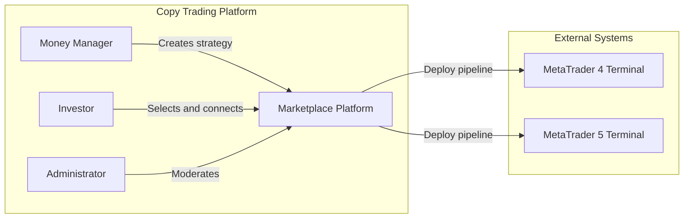

### 2.2 Core Business Processes

| Stage | Description |
|-------|-------------|
| **Strategy Creation** | MM fills the form: name, logo, description, withdrawal policy, availability, trades history from, password protection |
| **Fee Configuration** | MM sets Performance Fee % + Agent Reward %, Subscription Fee (Daily/Weekly/Monthly/Annual) + Agent Reward %, Entry Fee % + Agent Reward % |
| **Robot Deploy** | MM uploads .ex4/.ex5 + .set files (upload or URL), configures connection parameters (login/password/server, MT version, chart, timeframe). Apply settings → Launch terminal |
| **Connection** | Automatic login to MT terminal, robot attachment, settings application, launch |
| **Viewing (investor)** | Strategy list, detail page with AreaChart, paginated trade history, metrics (drawdown, win rate) |
| **Investor Connection** | Investor opens DeployDialog, enters MT account credentials, copies trades |
| **Management (MM)** | Disconnect investor, delete strategy |

### 2.3 Supported Platforms

| Platform | Versions | File Formats | Features |
|----------|----------|--------------|----------|
| **MetaTrader 4 (MT4)** | build 1350+ | `.ex4` (robot), `.set` (settings) | Login / Password / Server |
| **MetaTrader 5 (MT5)** | build 3500+ | `.ex5` (robot), `.set` (settings) | Login / Password / Server |

---

## 3. Functional Requirements

### 3.1 Frontend Requirements

#### 3.1.1 Home Page (`/`)

| ID | Requirement | Priority |
|----|-------------|----------|
| FR-FE-01 | Display platform stats: Total Strategies, Total Investors, Total Funds, Top Growth | High |
| FR-FE-02 | "Generate demo strategies" button to populate DB with test data | Medium |
| FR-FE-03 | Tabs: How does it work, Available Strategies, Investment Results, For Money Manager | High |
| FR-FE-04 | StrategiesTab — list of strategy cards with name, logo, growth, drawdown, investors, AUM, fee | High |
| FR-FE-05 | Click on a strategy navigates to StrategyDetail | High |

#### 3.1.2 Strategy Detail Page (`/strategy/:id`)

| ID | Requirement | Priority |
|----|-------------|----------|
| FR-FE-10 | Display logo, name, breadcrumb | High |
| FR-FE-11 | Profit/Loss AreaChart with gradient fill (green/red) | High |
| FR-FE-12 | Info Panel: Profit/Loss %, Drawdown %, Min Investment, Investor's funds, Investors, Days, Withdrawal Policy, Trades History From | High |
| FR-FE-13 | Fee sections: Performance Fee / Agent Reward, Subscription Fee / Agent Reward, Entry Fee / Agent Reward | High |
| FR-FE-14 | Paginated Trade History table (20 records per page) | High |
| FR-FE-15 | Paginator with page numbers, Previous/Next, current page highlight | Medium |
| FR-FE-16 | "Connect to strategy" button — opens DeployDialog | High |
| FR-FE-17 | MM controls: Disconnect (remove investor), Delete (remove strategy) | Medium |

#### 3.1.3 Strategy Create Tab (For Money Manager)

| ID | Requirement | Priority |
|----|-------------|----------|
| FR-FE-20 | Logo upload field (preview, drag-and-click) | Medium |
| FR-FE-21 | Fields: Strategy Name, Withdrawal Policy (Anytime/Daily/Weekly/Monthly), Min Investment, Trades History From (datetime-local) | High |
| FR-FE-22 | Strategy Availability: All / User Group / User Name + Account (conditional userName/userAccount fields) | High |
| FR-FE-23 | Description textarea | Medium |
| FR-FE-24 | Password Protected toggle | Low |
| FR-FE-25 | Performance Fee: toggle on/off, Fee %, Agent Fee % | High |
| FR-FE-26 | Subscription Fee: toggle on/off, Type (Daily/Weekly/Monthly/Annual), Fee USD, Agent Fee % | High |
| FR-FE-27 | Entry Fee: toggle on/off, Fee %, Agent Fee % | Medium |
| FR-FE-28 | Form validated via zod (name required, min invest > 0, fee ranges) | High |
| FR-FE-29 | After creation — success toast, form reset, return to empty state | Medium |

#### 3.1.4 DeployDialog

| ID | Requirement | Priority |
|----|-------------|----------|
| FR-FE-30 | Upload .ex4/.ex5 file via upload or URL | High |
| FR-FE-31 | Upload .set settings file (optional) | Medium |
| FR-FE-32 | Fields: MT Login, MT Password, MT Server | High |
| FR-FE-33 | MetaTrader version selection (MT4 / MT5) | High |
| FR-FE-34 | Chart / Timeframe selection (optional) | Low |
| FR-FE-35 | Deployment log — step-by-step upload/apply/launch status | Medium |
| FR-FE-36 | "Deploy" button — runs full pipeline | High |

### 3.2 Backend Requirements

#### 3.2.1 Strategy Management

| ID | Requirement | Priority |
|----|-------------|----------|
| FR-BE-01 | POST `/api/strategies/` — create strategy with all fields (name, minInvest, withdrawalPolicy, passwordProtected, availability, userName, userAccount, tradesHistoryFrom, description, fees) | High |
| FR-BE-02 | GET `/api/strategies/` — list strategies (StrategyListItem: id, name, logoUrl, growthPercent, minInvest, investors, totalFunds, days, performanceFee, chartPoints) | High |
| FR-BE-03 | GET `/api/strategies/{id}` — strategy details (StrategyDetail: all fields + fees + settings) | High |
| FR-BE-04 | DELETE `/api/strategies/{id}` — delete strategy (MM) | Medium |
| FR-BE-05 | POST `/api/strategies/seed` — generate 6 demo strategies with realistic data (performance, trades, settings) | Medium |

#### 3.2.2 Performance and Trade History

| ID | Requirement | Priority |
|----|-------------|----------|
| FR-BE-10 | GET `/api/strategies/{id}/performance` — array of PerformancePoint (date, value) for AreaChart | High |
| FR-BE-11 | GET `/api/strategies/{id}/trades?page=&page_size=` — paginated trade history (TradeHistory: trades[], total, page, pageSize, totalPages) | High |
| FR-BE-12 | `_generate_mock_performance()` — generate chart points, trades, drawdown, win rate based on days/growth_percent | High |

#### 3.2.3 Deploy and Connect

| ID | Requirement | Priority |
|----|-------------|----------|
| FR-BE-20 | POST `/{id}/deploy/upload` — upload .ex4/.ex5/.set files, save to deploy_files/{id}/ | High |
| FR-BE-21 | POST `/{id}/deploy/url` — download robot file from URL | Medium |
| FR-BE-22 | POST `/{id}/deploy/launch` — generate .ini file, launch MT terminal via subprocess | High |
| FR-BE-23 | POST `/{id}/deploy` — full pipeline: upload + launch | High |
| FR-BE-24 | POST `/{id}/connect-account` — copy files, generate .ini, launch terminal for investor | High |
| FR-BE-25 | POST `/{id}/disconnect-investor` — stop investor terminal (MM action) | Medium |

#### 3.2.4 Marketplace and System

| ID | Requirement | Priority |
|----|-------------|----------|
| FR-BE-30 | GET `/api/healthz` — server health check | Low |
| FR-BE-31 | GET `/api/stats` — stats: totalStrategies, totalInvestors, totalFunds, topGrowth | Medium |
| FR-BE-32 | Remaining legacy endpoints: connect, start, stop, replace-robot, approve, reject, submit, marketplace, investor connect/disconnect | High |

### 3.3 Fee System Requirements

| ID | Requirement | Priority |
|----|-------------|----------|
| FR-FEE-01 | Three fee types: Performance Fee (%), Subscription Fee (fixed), Entry Fee (%) | High |
| FR-FEE-02 | Each type has toggle on/off (performanceFeeEnabled, subscriptionFeeEnabled, entryFeeEnabled) | High |
| FR-FEE-03 | Each type has Agent Reward % (performanceAgentFee, subscriptionAgentFee, entryAgentFee) | Medium |
| FR-FEE-04 | Subscription Fee has period type: Daily / Weekly / Monthly / Annual | High |
| FR-FEE-05 | Fee settings stored in performance_data["settings"] JSON blob | High |

---

## 4. Process Diagrams (BPMN)

### 4.1 Full Strategy Creation and Deploy Process

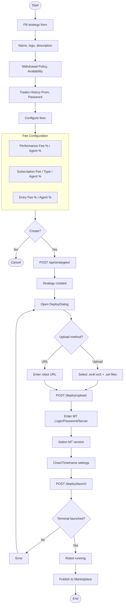

### 4.2 Investor Process (Connecting to Strategy)

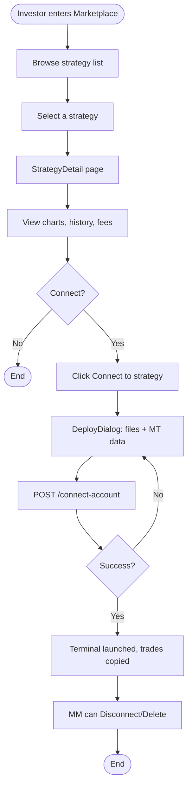

### 4.3 MM Process (Management)

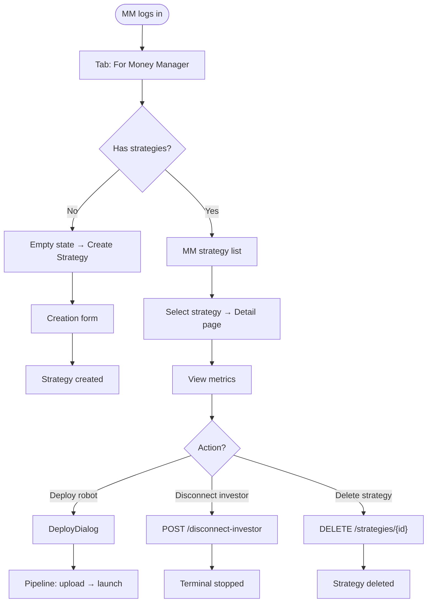

### 4.4 Strategy State Diagram

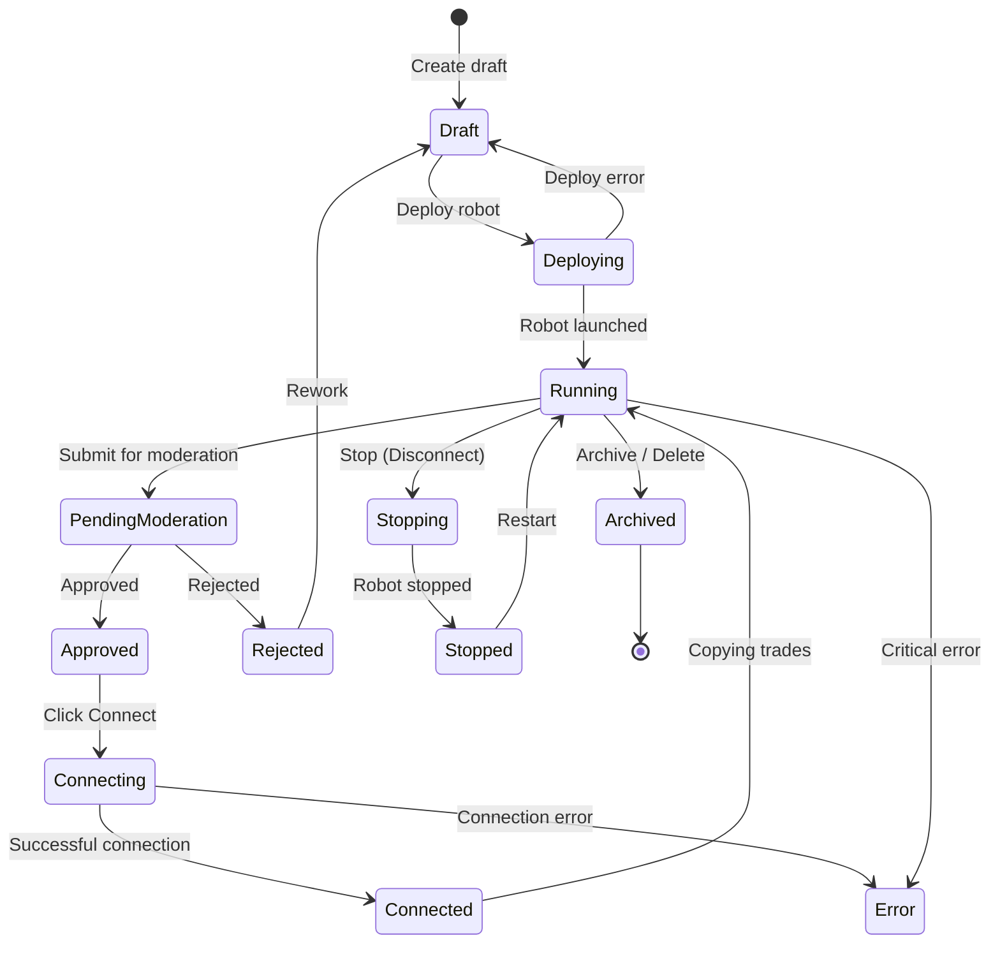

---

## 5. Sequence Diagrams

### 5.1 Strategy Creation (with Extended Fields)

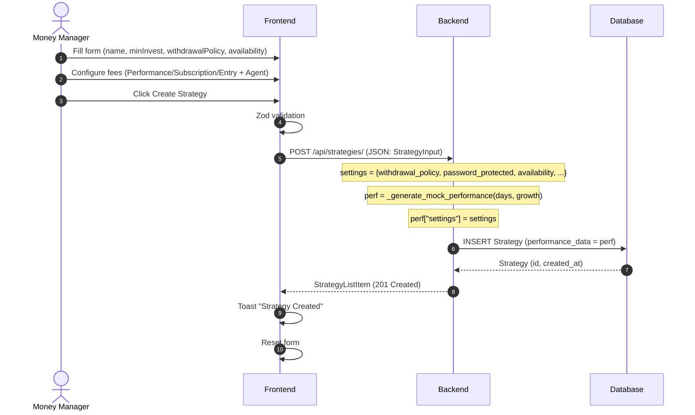

### 5.2 Deploy Pipeline (upload + launch)

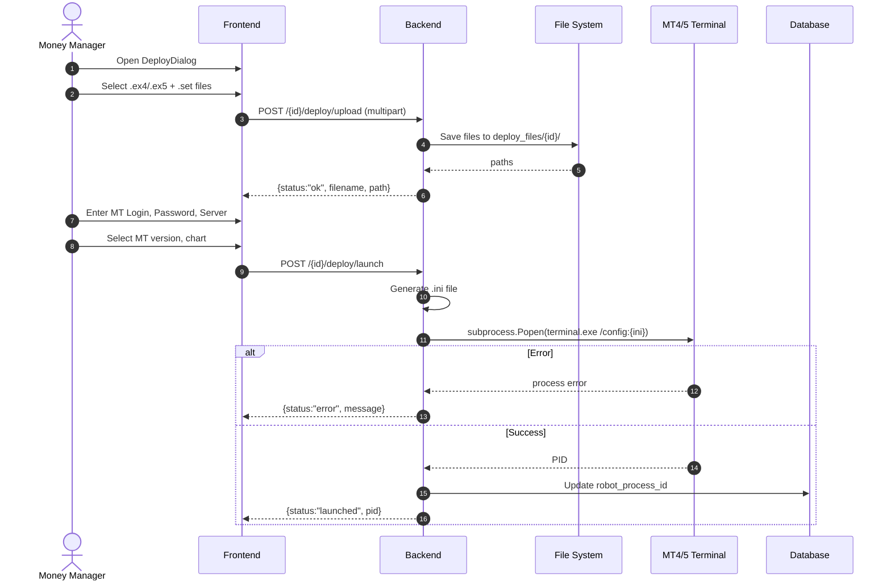

### 5.3 Connect Account (Investor)

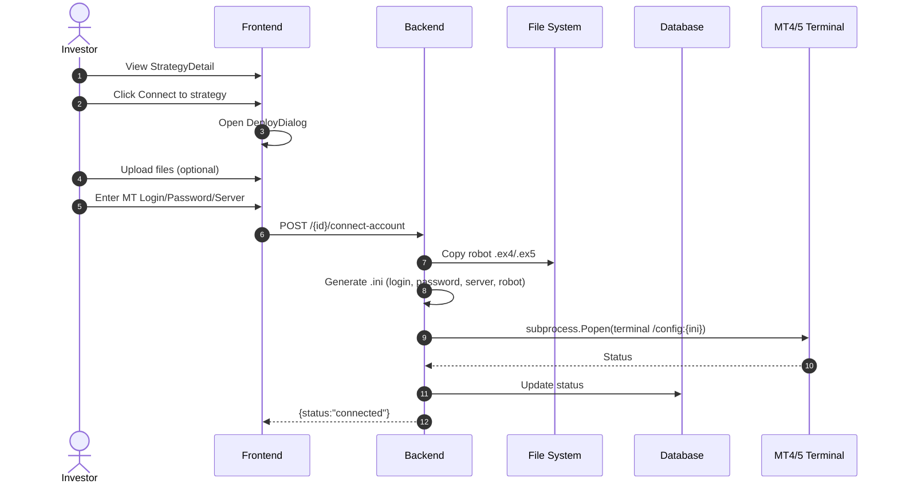

### 5.4 View Performance and Trade History

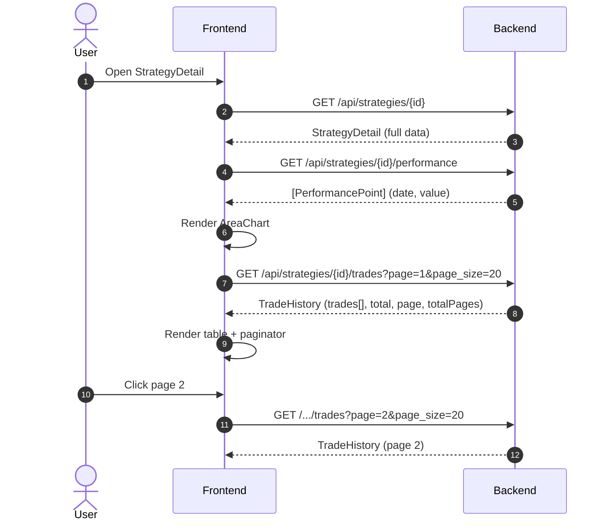

### 5.5 Seed Generation

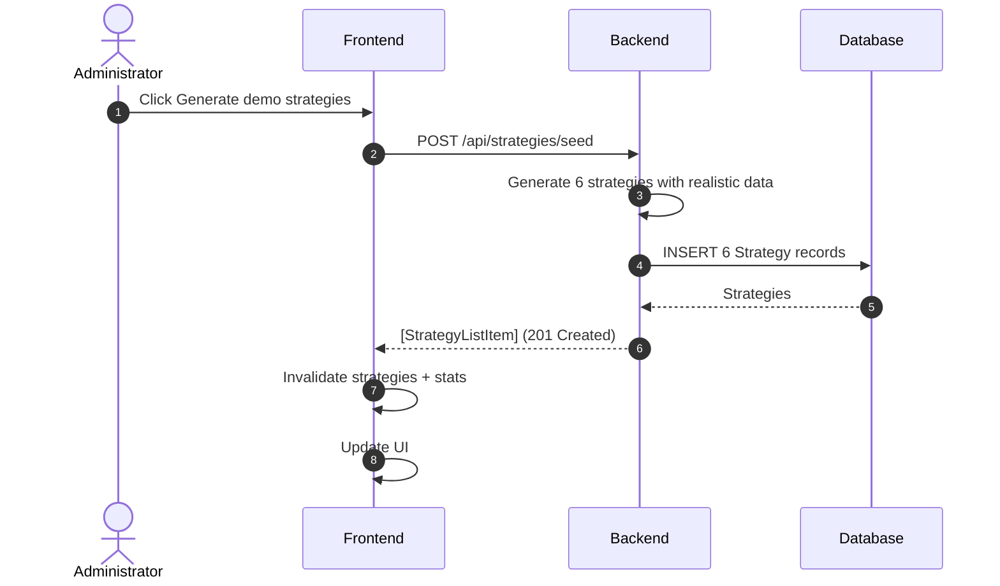

---

## 6. Architecture (C4 Container Diagram)

### 6.1 C4 Container Diagram

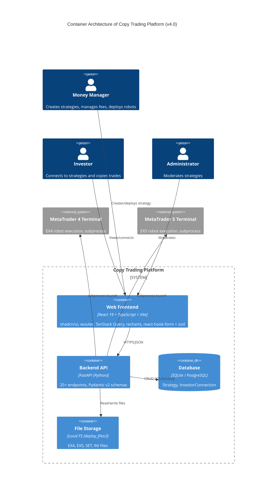

### 6.2 Technology Stack

| Component | Technology | Version |
|-----------|-----------|---------|
| Frontend framework | React | 19.1 |
| Language | TypeScript | 5.9 |
| Build tool | Vite | 7.3 |
| CSS framework | Tailwind CSS | 4.1 |
| UI library | shadcn/ui (Radix primitives) | latest |
| Routing | wouter | 3.3 |
| Server state | TanStack Query | 5.90 |
| Forms | react-hook-form + zod | 7.55 / 3.25 |
| Charts | recharts | 2.15 |
| Backend | Python | 3.14 |
| API framework | FastAPI | latest |
| ORM | SQLAlchemy | latest |
| Validation | Pydantic | v2 |
| Database | SQLite (dev) / PostgreSQL (prod) | - |

---

## 7. Key Assumptions

### 7.1 General Assumptions

| ID | Assumption | Rationale |
|----|------------|-----------|
| AS-01 | Platform has access to MT4/MT5 terminal instances | Required for subprocess automation |
| AS-02 | SET file correctly maps to Common and Inputs tabs | Without this, settings cannot be applied |
| AS-03 | One robot per account (replacement only via confirmation) | Technical limitation of MT4/MT5 |
| AS-04 | Strategy undergoes moderation before publication | Based on Valetax requirements |
| AS-05 | All fee types can be enabled/disabled independently | Flexibility for MM |
| AS-06 | Agent Reward is a fixed % of Performance/Subscription/Entry fee | Partner commission model |
| AS-07 | Seed strategies use `settings` in `performance_data` for fee fields | Unified storage format |

### 7.2 Deploy Pipeline

| ID | Assumption | Rationale |
|----|------------|-----------|
| AS-DP-01 | Robot files are valid (.ex4/.ex5) before upload | Client-side validation |
| AS-DP-02 | MT terminal is in system PATH | Required for subprocess launch |
| AS-DP-03 | INI config file format is correct for the terminal | Standard MT format |

---

## 8. Open Questions

| ID | Question | Owner | Priority |
|----|----------|-------|----------|
| OQ-01 | How are MT4/MT5 terminal instances scaled for 100+ robots? | Architect | High |
| OQ-02 | Is server-side validation of .ex4/.ex5 files needed? | Tech Lead | Medium |
| OQ-03 | How to handle the case when MM deletes a strategy with active investors? | Product Owner | High |
| OQ-04 | Should Subscription and Entry fees be credited to the Agent in real-time? | Architect | Medium |
| OQ-05 | What is the retention policy for deploy_files/ directory? | DevOps | Low |
| OQ-06 | Is authorization required for endpoints (JWT)? | Tech Lead | High |
| OQ-07 | How to handle when an investor connects but MM has not yet deployed the robot? | Product Owner | Medium |
| OQ-08 | Should Performance Fee be charged only on profit or on total turnover? | Product Owner | High |

---

## 9. Risks and Edge Cases

### 9.1 Deploy Risks

| ID | Risk | Probability | Impact | Mitigation |
|----|------|-------------|--------|------------|
| RS-DP-01 | Invalid credentials | Medium | High | Unblock, re-enter |
| RS-DP-02 | Robot conflict on account | Low | Medium | Disconnect before new deploy |
| RS-DP-03 | Robot file corrupted/incompatible | Medium | High | Extension validation |
| RS-DP-04 | MT terminal not installed | Low | Critical | Check before deploy |
| RS-DP-05 | Deploy_files accumulate on disk | Medium | Low | Regular cleanup |

### 9.2 Fee System Risks

| ID | Risk | Probability | Impact | Mitigation |
|----|------|-------------|--------|------------|
| RS-FEE-01 | MM sets 100% Performance Fee | Low | Medium | Max 100% limit |
| RS-FEE-02 | Agent Reward exceeds base fee | Low | Medium | Max 100% validation |
| RS-FEE-03 | Subscription Fee enabled but rate is 0 | Medium | Low | Allowed (free subscription) |

### 9.3 Copy Trading Risks

| ID | Risk | Probability | Impact | Mitigation |
|----|------|-------------|--------|------------|
| RS-CT-01 | Investor connects to unprofitable strategy | High | Medium | Transparent stats, warnings |
| RS-CT-02 | Trade copying delay | Medium | High | Adapter optimization |
| RS-CT-03 | MM disconnects robot without notification | Medium | Medium | Notify investors |

### 9.4 Edge Cases

| ID | Situation | Expected Behavior |
|----|-----------|-------------------|
| EC-01 | Create strategy without fees | All toggles = off, values 0 |
| EC-02 | Availability = "userName" without filling userName | Validation error |
| EC-03 | Deploy with empty robot file | Validation error |
| EC-04 | Disconnect when no active investors | Nothing happens |
| EC-05 | Delete strategy with connected investors | All investors disconnected |
| EC-06 | Seed when strategies already exist | Adds 6 new ones |
| EC-07 | Trades History From in the future | Warning |
| EC-08 | Subscription Fee Type = Annual, strategy created today | Fee charged annually |
| EC-09 | Password Protection enabled but no password set | Password not required (optional) |

---

## 10. Page Mockups

### 10.1 Home Page (Marketplace)

```
┌──────────────────────────────────────────────────────────────┐
│  Copy Trading                            [Generate demo]     │
│                                                              │
│  ┌─────────┐  ┌─────────┐  ┌─────────┐  ┌─────────┐         │
│  │Total    │  │Total    │  │Total    │  │Top      │         │
│  │Strateg. │  │Investors│  │Funds    │  │Growth   │         │
│  │  42     │  │  255    │  │ $1.8M   │  │ +64.7%  │         │
│  └─────────┘  └─────────┘  └─────────┘  └─────────┘         │
│                                                              │
│  ┌──────────────────────────────────────────────────┐        │
│  │ [How it works] [Available Strategies] [Results]  │        │
│  │ [For Money Manager]                              │        │
│  └──────────────────────────────────────────────────┘        │
│                                                              │
│  ┌───────┐ ┌───────┐ ... ┌───────┐                           │
│  │Card 1 │ │Card 2 │     │Card N │                           │
│  │+45.2% │ │+32.1% │     │+12.7% │                           │
│  │34 inv │ │18 inv │     │87 inv │                           │
│  │$245K  │ │$89K   │     │$678K  │                           │
│  └───────┘ └───────┘     └───────┘                           │
└──────────────────────────────────────────────────────────────┘
```

### 10.2 Strategy Detail Page (Investor/MM)

```
┌──────────────────────────────────────────────────────────────┐
│ Available Strategies > EURUSD Grid Master  [Disconnect][Del] │
│                                                              │
│ [Logo] EURUSD Grid Master                                    │
│        Availability: all                                     │
│                                                              │
│  ┌──────────────────────────┐  ┌──────────────────────────┐  │
│  │     Profit/Loss (%)      │  │  Strategy Information     │  │
│  │                          │  │                          │  │
│  │  📈 AreaChart            │  │ Profit/Loss:   +45.2%    │  │
│  │     (green gradient)     │  │ Drawdown:       12.3%    │  │
│  │                          │  │ Min Investment:  $100    │  │
│  │                          │  │ Investor's funds:$245K   │  │
│  │                          │  │ Investors:       34      │  │
│  │                          │  │ Days:           180      │  │
│  │                          │  │ Withdrawal:    anytime   │  │
│  │                          │  │                          │  │
│  │                          │  │ ── Fees ──               │  │
│  │                          │  │ Perf Fee: 30% / 10%     │  │
│  │                          │  │ Sub Fee: $50(mon)/5%    │  │
│  │                          │  │ Entry Fee: 2% / 1%      │  │
│  │                          │  │                          │  │
│  │                          │  │ [Connect to strategy]    │  │
│  └──────────────────────────┘  └──────────────────────────┘  │
│                                                              │
│  ┌──────────────────────────────────────────────────────────┐│
│  │  History of Past Trades              Page 1 of 8         ││
│  │  ┌─────────┬──────────┬────────┬──────────┬──────┬────┐ ││
│  │  │Instrument│Open Time│Open Pr│Close Time│Type  │Prof│ ││
│  │  ├─────────┼──────────┼────────┼──────────┼──────┼────┤ ││
│  │  │EURUSD   │2026-... │1.12345 │2026-...  │Buy ▲ │+$45│ ││
│  │  │GBPUSD   │2026-... │1.34567 │2026-...  │Sell ▼│-$12│ ││
│  │  │...      │         │        │          │      │    │ ││
│  │  └─────────┴──────────┴────────┴──────────┴──────┴────┘ ││
│  │     [Prev] 1 2 3 4 5 6 7 8 [Next]                       ││
│  └──────────────────────────────────────────────────────────┘│
└──────────────────────────────────────────────────────────────┘
```

### 10.3 Strategy Create Form (Money Manager)

```
┌──────────────────────────────────────────────────────────────┐
│  Create Strategy                                             │
│  Set up your strategy parameters to attract investors.       │
│                                                              │
│  [Upload Logo]    Strategy Logo                              │
│   ○ ○ ○           Recommended: 256x256px. JPG, PNG, SVG     │
│                                                              │
│  ┌──────────────────────┐  ┌──────────────────────┐         │
│  │ Strategy Name        │  │ Withdrawal Policy    │         │
│  │ [My Strategy      ]  │  │ [Anytime        ▼]   │         │
│  └──────────────────────┘  └──────────────────────┘         │
│  ┌──────────────────────┐  ┌──────────────────────┐         │
│  │ Min Investment, USD  │  │ Trades History From  │         │
│  │ [100               ] │  │ [2025-01-01T00:00 ]  │         │
│  └──────────────────────┘  └──────────────────────┘         │
│                                                              │
│  ┌─ Strategy Availability ─────────────────────────────┐     │
│  │ [All ▼]                                             │     │
│  └─────────────────────────────────────────────────────┘     │
│                                                              │
│  ┌─ Strategy Description ──────────────────────────────┐     │
│  │                                                     │     │
│  │  [Textarea...                                     ] │     │
│  │                                                     │     │
│  └─────────────────────────────────────────────────────┘     │
│                                                              │
│  ┌─ Password protected ───────────────────────────────┐     │
│  │ Require password to connect              [toggle]   │     │
│  └─────────────────────────────────────────────────────┘     │
│  ────────────────────────────────────────────────────────── │
│                                                              │
│  ┌─ Performance Fee ──────────────── [toggle ON] ──────┐    │
│  │ Fee (%) [30]    Agent Fee (%) [10]                  │    │
│  └─────────────────────────────────────────────────────┘    │
│                                                              │
│  ┌─ Subscription Fee ─────────────── [toggle OFF] ─────┐    │
│  │ Type [Monthly ▼]   Fee (USD) [0]  Agent Fee (%) [0] │    │
│  └─────────────────────────────────────────────────────┘    │
│                                                              │
│  ┌─ Entry Fee ──────────────────── [toggle OFF] ──────┐    │
│  │ Fee (%) [0]    Agent Fee (%) [0]                   │    │
│  └─────────────────────────────────────────────────────┘    │
│                                                              │
│               [Cancel]              [Create Strategy]       │
└──────────────────────────────────────────────────────────────┘
```

### 10.4 Deploy Dialog

```
┌──────────────────────────────────────────────────────────────┐
│  Connect to strategy: EURUSD Grid Master                     │
│                                                              │
│  ┌─ Robot File ──────────────────────────────────────────┐  │
│  │  [Upload .ex4/.ex5] or [Enter URL]                    │  │
│  │  Uploaded: robot.ex4                                  │  │
│  └───────────────────────────────────────────────────────┘  │
│                                                              │
│  ┌─ Settings File (optional) ────────────────────────────┐  │
│  │  [Upload .set]                                        │  │
│  │  No file selected                                     │  │
│  └───────────────────────────────────────────────────────┘  │
│                                                              │
│  ┌─ Account ────────────────────────────────────────────┐  │
│  │  MT Login    [12345678        ]                       │  │
│  │  MT Password [********        ]                       │  │
│  │  MT Server   [Alpari-Demo     ]                       │  │
│  └───────────────────────────────────────────────────────┘  │
│                                                              │
│  ┌─ Settings ────────────────────────────────────────────┐  │
│  │  MetaTrader version: ○ MT4  ● MT5                    │  │
│  │  Chart: [EURUSD ▼]  Timeframe: [H1 ▼]                │  │
│  └───────────────────────────────────────────────────────┘  │
│                                                              │
│  ┌─ Deployment Log ─────────────────────────────────────┐  │
│  │ ✅ Upload complete                                   │  │
│  │ ✅ Settings applied                                  │  │
│  │ ◌ Launching terminal...                              │  │
│  └───────────────────────────────────────────────────────┘  │
│                                                              │
│  [✕ Close]                      [Deploy]                    │
└──────────────────────────────────────────────────────────────┘
```

### 10.5 Money Manager Tab (Empty State)

```
┌──────────────────────────────────────────────────────────────┐
│                                                              │
│           [✏️]                                                │
│          There are no active strategies                      │
│    Create your first strategy to start accepting             │
│    investments                                               │
│                                                              │
│              [Create Strategy]                               │
│                                                              │
└──────────────────────────────────────────────────────────────┘
```

---

## 11. API Requests

### 11.1 Create Strategy

```http
POST /api/strategies/
Content-Type: application/json

{
  "name": "My Strategy",
  "minInvest": 100,
  "withdrawalPolicy": "weekly",
  "passwordProtected": false,
  "availability": "all",
  "tradesHistoryFrom": "2025-01-01T00:00",
  "description": "Strategy description",
  "performanceFeeEnabled": true,
  "performanceFee": 30,
  "performanceAgentFee": 10,
  "entryFeeEnabled": false,
  "entryFee": 0,
  "entryAgentFee": 0,
  "subscriptionFeeEnabled": true,
  "subscriptionFeeType": "monthly",
  "subscriptionFee": 50,
  "subscriptionAgentFee": 5
}

Response (201):
{
  "id": 123,
  "name": "My Strategy",
  "logoUrl": null,
  "growthPercent": 0,
  "minInvest": 100,
  "investors": 0,
  "totalFunds": 0,
  "days": 0,
  "performanceFee": 30,
  "chartPoints": []
}
```

### 11.2 List Strategies

```http
GET /api/strategies/?search=eur&sortBy=growthPercent&order=desc

Response (200):
[
  {
    "id": 123,
    "name": "EURUSD Grid Master",
    "logoUrl": null,
    "growthPercent": 45.2,
    "minInvest": 100,
    "investors": 34,
    "totalFunds": 245000,
    "days": 180,
    "performanceFee": 30,
    "chartPoints": [0.5, 1.2, 2.8, ...]
  }
]
```

### 11.3 Strategy Details

```http
GET /api/strategies/{id}

Response (200):
{
  "id": 123,
  "name": "EURUSD Grid Master",
  "logoUrl": null,
  "growthPercent": 45.2,
  "minInvest": 100,
  "investors": 34,
  "totalFunds": 245000,
  "days": 180,
  "drawdown": 12.3,
  "withdrawalPolicy": "weekly",
  "passwordProtected": false,
  "availability": "all",
  "userName": null,
  "userAccount": null,
  "tradesHistoryFrom": null,
  "description": "Professional EURUSD Grid Master...",
  "performanceFeeEnabled": true,
  "performanceFee": 19.6,
  "performanceAgentFee": 14.0,
  "entryFeeEnabled": true,
  "entryFee": 1.6,
  "entryAgentFee": 4.4,
  "subscriptionFeeEnabled": true,
  "subscriptionFeeType": "daily",
  "subscriptionFee": 72.1,
  "subscriptionAgentFee": 4.5
}
```

### 11.4 Performance (Chart)

```http
GET /api/strategies/{id}/performance

Response (200):
[
  {"date": "2026-01-01", "value": 0.5},
  {"date": "2026-01-02", "value": 1.2},
  {"date": "2026-01-03", "value": 2.8},
  ...
]
```

### 11.5 Trade History (Paginated)

```http
GET /api/strategies/{id}/trades?page=1&page_size=20

Response (200):
{
  "trades": [
    {
      "id": 1,
      "instrument": "EURUSD",
      "openTime": "2026-01-15 10:30:00",
      "openPrice": 1.12345,
      "closeTime": "2026-01-15 14:30:00",
      "closePrice": 1.12650,
      "tradeType": "buy",
      "volume": 0.5,
      "profit": 45.20
    }
  ],
  "total": 156,
  "page": 1,
  "pageSize": 20,
  "totalPages": 8
}
```

### 11.6 Seed Generation

```http
POST /api/strategies/seed

Response (201):
[
  {
    "id": 124,
    "name": "EURUSD Grid Master",
    "growthPercent": 45.2,
    "minInvest": 100,
    "investors": 34,
    "totalFunds": 245000,
    "days": 231,
    "performanceFee": 25,
    "chartPoints": [0.5, 1.2, ...]
  }
]
```

### 11.7 Delete Strategy

```http
DELETE /api/strategies/{id}

Response (200):
{
  "status": "deleted"
}
```

### 11.8 Deploy Upload

```http
POST /api/strategies/{id}/deploy/upload
Content-Type: multipart/form-data

robot_file: @robot.ex4
settings_file: @settings.set (optional)

Response (200):
{
  "status": "ok",
  "filename": "robot.ex4",
  "path": "deploy_files/123/robot.ex4"
}
```

### 11.9 Deploy URL

```http
POST /api/strategies/{id}/deploy/url
Content-Type: application/json

{
  "url": "https://example.com/robot.ex5"
}

Response (200):
{
  "status": "downloaded",
  "filename": "robot.ex5",
  "path": "deploy_files/123/robot.ex5"
}
```

### 11.10 Deploy Launch

```http
POST /api/strategies/{id}/deploy/launch
Content-Type: application/json

{
  "login": "12345678",
  "password": "secret",
  "server": "Alpari-Demo",
  "platform": "mt5",
  "chart": "EURUSD",
  "timeframe": "H1"
}

Response (200):
{
  "status": "launched",
  "pid": 12345,
  "message": "Terminal started successfully"
}
```

### 11.11 Deploy (Full Pipeline)

```http
POST /api/strategies/{id}/deploy
Content-Type: application/json

{
  "files": {
    "robot": { "type": "upload", "filename": "robot.ex5", "content": "base64..." },
    "settings": { "type": "upload", "filename": "settings.set", "content": "base64..." }
  },
  "account": {
    "login": "12345678",
    "password": "secret",
    "server": "Alpari-Demo"
  },
  "platform": "mt5",
  "chart": "EURUSD",
  "timeframe": "H1"
}

Response (200):
{
  "steps": [
    { "step": "upload", "status": "done" },
    { "step": "settings", "status": "done" },
    { "step": "launch", "status": "done", "pid": 12345 }
  ],
  "status": "completed"
}
```

### 11.12 Connect Account (Investor)

```http
POST /api/strategies/{id}/connect-account
Content-Type: application/json

{
  "login": "87654321",
  "password": "secret",
  "server": "Alpari-Real",
  "platform": "mt4",
  "chart": "GBPUSD",
  "timeframe": "M15"
}

Response (200):
{
  "status": "connected",
  "message": "Terminal launched for investor",
  "pid": 12346
}
```

### 11.13 Disconnect Investor (MM)

```http
POST /api/strategies/{id}/disconnect-investor

Response (200):
{
  "status": "disconnected",
  "message": "Investor terminal stopped"
}
```

### 11.14 Health Check

```http
GET /api/healthz

Response (200):
{
  "status": "healthy"
}
```

### 11.15 Stats

```http
GET /api/stats

Response (200):
{
  "totalStrategies": 42,
  "totalInvestors": 255,
  "totalFunds": 1835000,
  "topGrowth": 64.7
}
```

### 11.16 Remaining Legacy Endpoints

| Method | Endpoint | Description |
|--------|----------|-------------|
| POST | `/api/strategies/{id}/connect` | Connect to MT4/MT5 |
| POST | `/api/strategies/{id}/start` | Start robot |
| POST | `/api/strategies/{id}/stop` | Stop robot |
| GET | `/api/strategies/{id}/status` | Robot status |
| POST | `/api/strategies/{id}/replace-robot` | Check replacement |
| POST | `/api/strategies/{id}/confirm-replace` | Confirm replacement |
| PUT | `/api/strategies/{id}/submit` | Submit for moderation |
| PUT | `/api/strategies/{id}/approve` | Approve strategy |
| PUT | `/api/strategies/{id}/reject` | Reject strategy |
| GET | `/api/strategies/marketplace` | Marketplace with filtering |
| POST | `/api/strategies/investor/connect` | Investor connect |
| POST | `/api/strategies/investor/disconnect/{id}` | Investor unsubscribe |

---

## 12. Non-Functional Requirements

### 12.1 Performance

| ID | Requirement | Target |
|----|-------------|--------|
| NFR-PERF-01 | API response time (95th percentile) | < 500 ms |
| NFR-PERF-02 | Frontend load time (FCP) | < 2 sec |
| NFR-PERF-03 | Trade copy latency | < 1 second |
| NFR-PERF-04 | Maximum concurrent running robots | 500 |
| NFR-PERF-05 | Trade History pagination | < 200 ms per page |

### 12.2 Security

| ID | Requirement | Description |
|----|-------------|-------------|
| NFR-SEC-01 | MT password storage | In .ini files (locally) |
| NFR-SEC-02 | File validation | Extension check (.ex4/.ex5/.set) |
| NFR-SEC-03 | XSS protection | React built-in |

### 12.3 Logging

| ID | Requirement | Description |
|----|-------------|-------------|
| NFR-LOG-01 | Health check | `/api/healthz` |
| NFR-LOG-02 | Deploy log | Step-by-step log in DeployDialog |
| NFR-LOG-03 | Stats | `/api/stats` |

---

## 13. Glossary

| Term | Definition |
|------|------------|
| **EX4** | Compiled robot file for MT4 |
| **EX5** | Compiled robot file for MT5 |
| **SET** | Robot settings file (Common/Inputs) |
| **Money Manager (MM)** | Manager who creates a strategy |
| **Copy Trading** | Service for automatic trade copying |
| **Performance Fee** | % of investor profit paid to MM |
| **Subscription Fee** | Fixed periodic charge (Daily/Weekly/Monthly/Annual) |
| **Entry Fee** | % of investor entry amount |
| **Agent Reward** | Agent (partner) share of the fee |
| **Withdrawal Policy** | Fund withdrawal rules (Anytime/Daily/Weekly/Monthly) |
| **Availability** | Strategy visibility (All/User Group/User Name+Account) |
| **AUM** | Assets Under Management |
| **Drawdown** | Maximum peak-to-trough decline |
| **Deploy pipeline** | Process: upload files → apply settings → launch terminal |
| **Seed** | Demo strategy generation for testing |

---

## 14. Appendix A. Implementation Status

### 14.1 Developed Components

| Component | Technology | Status |
|-----------|-----------|--------|
| Frontend (5 pages/components) | React 19 + TypeScript + Vite 7 + shadcn/ui | ✅ Implemented |
| Backend API (25+ endpoints) | FastAPI (Python) | ✅ Implemented |
| Database | SQLite (SQLAlchemy ORM) | ✅ Implemented |
| Deploy pipeline | upload + URL + launch + full deploy | ✅ Implemented |
| Fee System | Performance + Subscription + Entry + Agent Reward | ✅ Implemented |
| Trade History | Paginated (page/page_size/total/totalPages) | ✅ Implemented |
| Seed generation | 6 demo strategies with realistic data | ✅ Implemented |

### 14.2 Implemented Pages

| Page / Component | Route | Description |
|------------------|-------|-------------|
| **Home** | `/` | Stats, tabs, strategy list, seed button |
| **StrategyDetail** | `/strategy/:id` | Info panel, AreaChart, paginated trades, DeployDialog, MM controls |
| **StrategyCreateTab** | Tab "For Money Manager" | Full form with logo, availability, fees |
| **DeployDialog** | Modal | Upload/URL, MT credentials, deploy log |
| **StrategiesTab** | Tab "Available Strategies" | Strategy cards |

### 14.3 API Endpoints (v4)

| Method | Endpoint | Description |
|--------|----------|-------------|
| GET | `/api/healthz` | Health check |
| GET | `/api/stats` | Platform stats |
| POST | `/api/strategies/` | Create strategy |
| GET | `/api/strategies/` | List strategies |
| GET | `/api/strategies/{id}` | Strategy details |
| DELETE | `/api/strategies/{id}` | Delete strategy |
| POST | `/api/strategies/seed` | Generate demo data |
| GET | `/api/strategies/{id}/performance` | Performance chart |
| GET | `/api/strategies/{id}/trades` | Trade History |
| POST | `/api/strategies/{id}/connect-account` | Investor connect |
| POST | `/api/strategies/{id}/disconnect-investor` | Disconnect (MM) |
| POST | `/api/strategies/{id}/deploy/upload` | Upload files |
| POST | `/api/strategies/{id}/deploy/url` | Download from URL |
| POST | `/api/strategies/{id}/deploy/launch` | Launch terminal |
| POST | `/api/strategies/{id}/deploy` | Full deploy |

### 14.4 Requirements Traceability

| Requirement | Status |
|-------------|--------|
| Strategy creation (name, logo, description) | ✅ |
| Withdrawal Policy, Availability, Password Protection | ✅ |
| Trades History From (datetime) | ✅ |
| Performance Fee / Agent Reward | ✅ |
| Subscription Fee (Daily/Weekly/Monthly/Annual) / Agent Reward | ✅ |
| Entry Fee / Agent Reward | ✅ |
| Three fee types with toggle on/off | ✅ |
| Upload .ex4 / .ex5 + .set via upload or URL | ✅ |
| Deploy pipeline (upload → settings → launch) | ✅ |
| MT4/MT5 connection (login/password/server) | ✅ |
| Connect-account for investor | ✅ |
| Disconnect and Delete (MM controls) | ✅ |
| AreaChart Profit/Loss with gradient | ✅ |
| Paginated Trade History | ✅ |
| Seed demo data generation | ✅ |
| Health check and Stats | ✅ |
| Standalone frontend (shadcn/ui, wouter, TanStack Query) | ✅ |
| BPMN, Sequence, C4, State diagrams (Mermaid) | ✅ |
| Page mockups | ✅ |
| API requests (detailed documentation) | ✅ |

### 14.5 Project Launch

```bash
# Backend
cd backend
pip install -r requirements.txt
python -m uvicorn app.main:app --reload --port 8000
# API docs: http://localhost:8000/docs

# Frontend
cd frontend/artifacts/trading-marketplace
pnpm install
pnpm dev
# Frontend: http://localhost:5173

# Seed demo data
curl -X POST http://localhost:8000/api/strategies/seed
```
